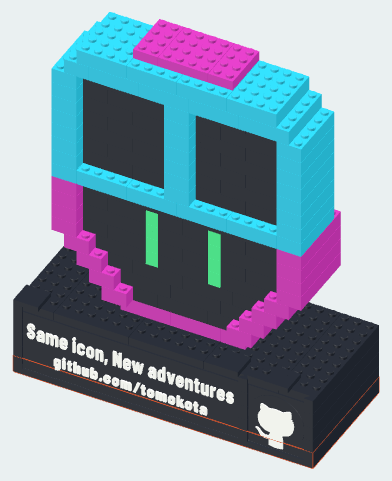
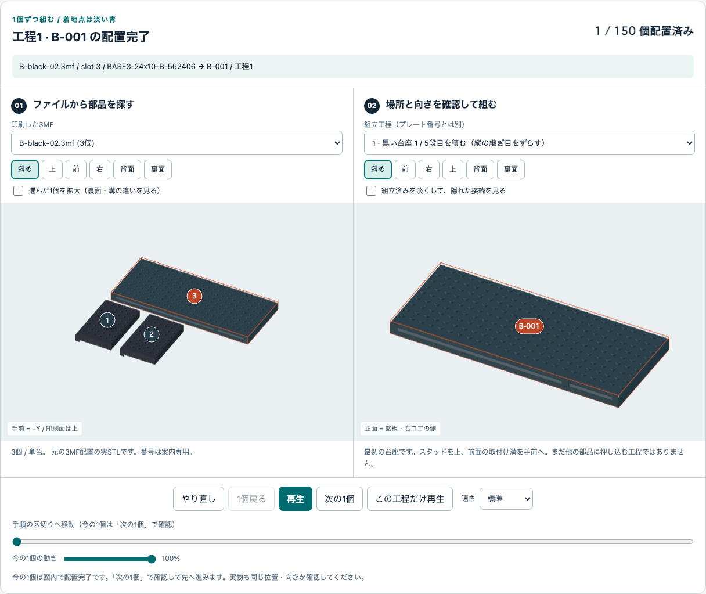
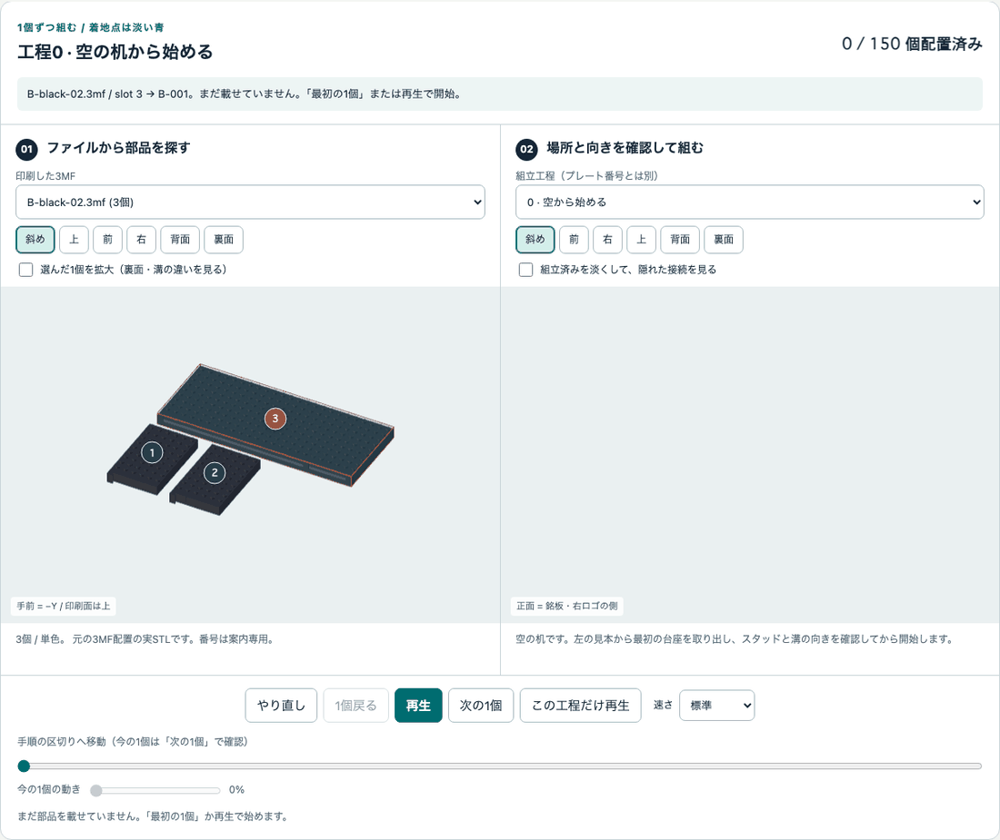
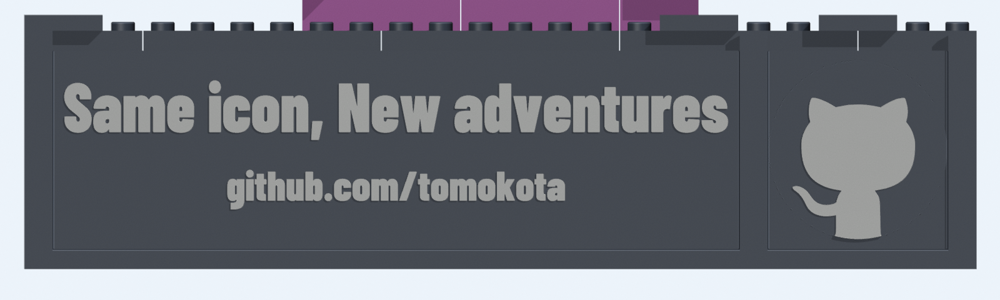
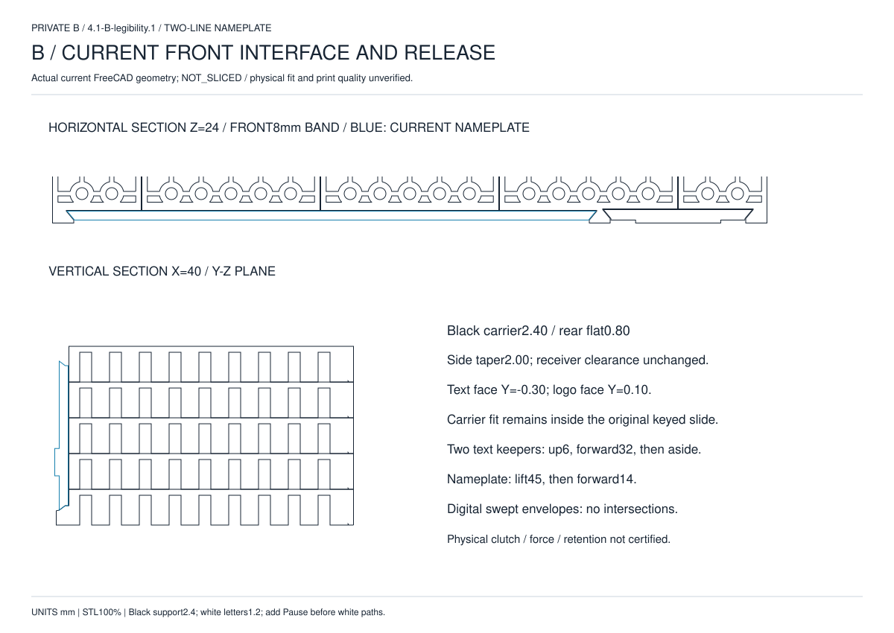

# Bを組み立てる・銘板を交換する・分解する

**実制作の進捗：** 2026-09-23に、[台座と前面部品を取り付けた写真・本人の報告](BUILD-LOG.md)を記録しました。
以下は設計に基づく組立案内です。写真から正確な段数、接着の有無や保持力を認定したものではありません。
顔・ゴーグル・全体完成の写真はまだ提供されていません。

**現在の銘板は承認済みの可読性改訂版です。** 上12 mm・下10 mm、白い浮彫1.2 mm、
全厚3.6 mmになりました。黒い取付け基材は同じため、以下の差込・keeper操作は変更ありません。
必要な再印刷は文字銘板だけで、[文字試験片](NAMEPLATE-V2.md)は完成150個に数えません。
白い文字の最前面が0.4 mm前へ出るため、完成奥行は80.2 mmです。台座本体は79.8 mmのままです。

[入口](../README.md) · [3Dガイド](../guide/index.html) · [印刷](PRINTING.md) · [少量試作](TRIAL.md) · [28工程の図](STEPS.md)

印刷と冷却を終え、段階試作で指による着脱を確認してから始めます。
接着剤は使いません。強く押す、こじる、打撃を加える、熱で無理に合わせることはしません。
大きい完成形の保持・強度・転倒は未試験です。

**まずZIPを展開し、`guide/index.html`をダブルクリックします。**
空の机から1個ずつ増える組立を、前／次、再生／停止、工程再生で確かめられます。
印刷済みのファイルを選び、部品のslotから組立位置を探すこともできます。
ネット接続やサーバー準備は不要です。[詳しい使い方](GUIDE.md)。

## 図と部品の見方

[B専用PDF](../kit/B/drawings.pdf)と[BOM](../kit/B/bom.csv)を手元に置きます。
PDFは54ページで、全体、分解参考、共通接続、BOM、28工程、21形状の寸法図を収録しています。
紙に出す場合は必要ページだけA4横などで読める大きさへ縮小して構いません。
図は型紙ではなく、寸法数字を参照するものです。**STL自体は100%から変えません。**

**工程平面図は、図の下が手前（銘板側）**です。鏡像にしません。
`B-001` などは**その場所に付ける1個の配置番号**、
`BR-02x04-H096` などは**同じ形状を共有する部品ID**です。
同じ形でも色・個数は[BOM](../kit/B/bom.csv)を確認し、ID別のトレーへ分けます。
3Dガイドの**slot番号は3MF内の部品順の目印**で、刻印ではありません。
同じ部品ID・色なら可換です。案内用の1対1割当を、どの実物がどこへ入るかの断定にしません。
色の見えにくい印刷図では、[工程CSV](../kit/B/steps.csv)と
[配置JSON](../kit/B/assembly.json)を併用してください。



## 1. 黒い台座を5段積む

| 工程 | 今回追加する配置番号 | 個数 | 案内上の出処（`B-*.3mf`） | 見る図 |
|---:|---|---:|---|---|
| 1 | `B-001` | 1 | **black-02 slot 3** | [台座1段目](../kit/B/drawings/step-01.svg) |
| 2 | `B-002`〜`B-005` | 4 | black-01、02、03 | [台座2段目](../kit/B/drawings/step-02.svg) |
| 3 | `B-006`〜`B-010` | 5 | black-01、03 | [台座3段目](../kit/B/drawings/step-03.svg) |
| 4 | `B-011`〜`B-014` | 4 | black-01、02、03 | [台座4段目](../kit/B/drawings/step-04.svg) |
| 5 | `B-015`〜`B-019` | 5 | black-01、**04** | [台座5段目](../kit/B/drawings/step-05.svg) |

**印刷順は組立順ではありません。** 1段目は
`B-black-02.3mf` のslot 3、`BASE3-24x10-B-562406`、
**191.8 × 79.8 mmの黒い台座部品1個だけ**です。
小さい部品を横に並べて1段目の代わりにしません。
平らな机に置き、手前のキー溝を確認します。



2段目は次の4個です。3MFごとではなく、**同じ工程に必要な部品を集めてから**載せます。

| 配置番号 | 部品ID | 案内上の出処 |
|---|---|---|
| `B-002` | `BASE3-06x10-T-e1945a` | `B-black-02.3mf` slot 1 |
| `B-003` | `BASE3-06x10-T-838259` | `B-black-03.3mf` slot 3 |
| `B-004` | `BASE3-06x10-T-3f87ac` | `B-black-03.3mf` slot 1 |
| `B-005` | `BASE3-06x10-T-6e100f` | `B-black-01.3mf` slot 7 |

2〜5段目は図の番号順に、継ぎ目が互い違いになる位置へ載せます。
下段を机で支え、軽い指の力で平行に押し、段間と四隅の浮きを見ます。
`black-01`の8個は2〜5段目で使います。同じ左端形状
`BASE3-03x10-T-aa77a9`の2個は`B-006`／`B-015`用で、左右ペアではありません。
外寸が同じでも溝形状の異なるID同士は代用しません。



台座本体は5×9.6＝**48 mm高、計19個**です。
前面5段のキー溝が一直線に通ることを確認してください。
最前列の補強帯には接続用の通常受け・スタッドを設けていない部分があります。
穴がないことを不良と決めつけて削ったり、市販ブロックを無理に接続したりしません。

## 2. 個人銘板と右ロゴを上から入れる

[工程6の図](../kit/B/drawings/step-06.svg)を見ながら、
左へ **`B-020 / NP3-TEXT-B`**、右へ **`B-021 / NP3-LOGO-B`** を
それぞれ独立した溝へ**上からまっすぐ**差し込みます。
完成配置ではどちらも台座内のZ=4〜44 mmに収まります。
印刷ファイルはそれぞれ `B-black-to-white-z2p4-01.3mf`／
`B-black-to-white-z2p8-01.3mf` のslot 1です。
印刷時は裏面を下、組立時は**X軸まわりに90度回して文字・図柄を手前**にします。
3Dガイドも実配置の90度回転を使い、黒い支持体と白いレリーフを分けて表示します。
銘板は個人版1枚への置換済みで、追加の151個目ではありません。



正しい2行：

```text
Same icon, New adventures
github.com/tomokota
```

反り・溝のずれ・途中の引っ掛かりで座らないときは止めます。
前から押し込む方式ではありません。文字やロゴを押して力をかけないでください。

## 3. 上止めのkeeperを3個載せる

[工程7の図](../kit/B/drawings/step-07.svg)で向きを確認し、
台座上の**2列目のスタッド**へ取り付けます。
案内上の出処は `B-black-07.3mf` のslot 8／9／10です。

| 配置番号 | 用途 |
|---|---|
| `B-022`、`B-023` | 銘板の上止め、2個 |
| `B-024` | 右ロゴの上止め、1個 |

keeperの下面受けは後ろ側の1列、前側は中実の上止めです。
前後を反転させないでください。`NP3-KEEPER` は接着せず取り外せる黒い独立部品です。
ここで大きい銘板の保持・溝の整列・交換経路を確認してから、顔へ進みます。
短い試験片や台座端部2個の試作だけでは、この確認を代用できません。

## 4. 顔を下から1段ずつ

[工程8〜26](STEPS.md)は本体19段です。各図の**新しく追加する番号**だけを取り、
色と形を照合して上から載せます。マゼンタ外周、黒い顔、緑の縦線、
シアンのゴーグルの位置を変えません。

最後に[工程27](../kit/B/drawings/step-27.svg)で
`B-148`〜`B-150` の頭頂マゼンタ3個を取り付けます。
顔・頭頂は合計126個です。台座19個＋前面2個＋keeper3個と合わせて**150個**になります。

細い1列部品も、種類ごとにまず1個のつかみやすさ・着脱を確認してください。
大きい2×2／2×4が扱えたから全小部品も大丈夫とは判断しません。
足りない・余る・色が違う場合は、無理に別部品で埋めずBOMと配置番号へ戻ります。

## 5. 飾る前に確認する

[工程28](../kit/B/drawings/step-28.svg)は新しい部品を追加しない確認工程です。
2行と右ロゴの位置、keeperの保持、段間の浮き、台座のがたつき、
前後左右への倒れやすさを、平らで低い机の奥側でそっと確認します。
完成品を反転したり、振ったり、押し倒したりする試験ではありません。

自然に外れる、ぐらつく、ひびが出る場合は飾らず、該当部品と実スライス条件を見直します。
棚の縁、直射日光、暖房器具の近く、車内には置きません。
持ち運びは**台座を両手で支えます**。頭、ゴーグル、銘板、ロゴ、keeperを持ち手にしません。

## 銘板だけ・ロゴだけを交換する



1. 模型を机に置き、台座を支えます。交換する部品に対応したkeeperだけを外します。
   銘板は2個、ロゴは1個です。
2. keeperを**上へ約6 mm**外し、**手前へ32 mm以上**離してから脇へ置きます。
3. 対象の銘板／ロゴを傾けずに**まっすぐ45 mm以上上へ**持ち上げて溝を抜き、
   その後で手前へ取り出します。
4. 同じ取付け仕様の部品を上から入れ、対応するkeeperを戻します。
   キットの銘板は最初から個人版です。初回組立で別の汎用銘板へ交換する必要はありません。

これは既存CADに基づく解除経路です。実物の軽い力での動作は別途確認が必要です。
指で安全につかめない・強い力が必要・ぶつかるときは止め、横へこじりません。
後ろの顔を持ち上げる取っ手として前面部品を使わないでください。

## 全部分解する

まず上記の方法で前面モジュールを外します。
次に顔を頭頂から工程の逆順に1段ずつ、最後に台座を5段目から外します。
下段を支え、外した部品を色・IDごとに戻します。
白化・ひび・欠けのある部品は再使用せず、原因を確認します。

[分解参考図](../kit/B/drawings/exploded.svg)は見やすく位置を離した表示です。
物理シミュレーション、許容荷重、実物の分解保証ではありません。
