# Bの制作記録 — 文字試作・土台から完成まで

[3D工程へ](../guide/index.html) · [印刷手順](PRINTING.md) · [組立手順](ASSEMBLY.md) · [銘板の設計改訂](NAMEPLATE-V2.md)

**2026-09-25、完成しました。**
「制作過程の写真です」に続き、**「これで完成ですね」**とご報告いただきました。
ゴーグルの上枠が閉じ、紫の頭頂パーツまでそろった姿を、実物の完成記録として残します。
[9/25の完成までの写真へ](#progress-2026-09-25)進むか、文字試作から順に読めます。
前の16枚を保持し、今回の8枚を加えて全24枚になりました。

**前の記録：2026-09-24、顔下部の組立途中。**
本人の言葉は「こちらは組み立ての途中記録になります」でした。
[9/24の節](#progress-2026-09-24)は、その日に届いた途中の状態として残しています。
当時の写真には上部ゴーグル・頭頂はまだ写っていません。

**前の記録：2026-09-23、「土台が組み上がりました」との報告。**
黒い台座、前面の空き溝、右ロゴを入れた状態、2行の個人銘板と右ロゴがそろった状態を、
ユーザー提供の実写真で記録します。ここまでの実制作の節目であり、
**顔・ゴーグル・150部品すべての完成写真ではありません。**

写真は各回の掲載許可を得て、必要な向き・切り取りを整え、元のメタデータを除去したものです。
一部写真には、無関係な背景PC画面などを隠す不透明マスクもあります。
造形の欠点・部品の段数・装着状態を変える合成はしていません。
以下の日付は**報告日**です。撮影日時や撮影順は未確定で、
別角度の写真がすべて別の工程・別の日を表すとは限りません。

## ここまでの流れ

| 報告日 | 本人の報告・写真で確認できること | 設計変更・未確認事項 |
|---|---|---|
| 2026-09-22 | 文字が小さく、隙間が狭くて印刷しにくそうとの相談。白文字の糸や表面の荒れも見える。使用ノズルは本人回答で0.2 mm | 2行を維持する方針で改訂。写真だけから流量・温度・乾燥状態の原因や補正値は決めていない |
| 2026-09-23 12:09 | 銘板2枚の写真と「いけているみたい」との報告 | 改訂後の試作についての手応えとして記録。2枚の旧・新版対応、STLや実スライスの版・hashは未照合 |
| 2026-09-23 12:18 | 「土台が組み上がりました」との報告。積層・継ぎ目・前面部品を取り付けた台座が写っている | 取付状態の写真はあるが、接着の有無、保持力、実測寸法、着脱回数、荷重・転倒の評価結果は未提供 |
| 2026-09-24 22:27 | 「こちらは組み立ての途中記録になります」との報告。土台の上の紫・黒の層、左右の段付き輪郭、黄色い縦2列が見える | 顔下部の途中記録。正確なCAD工程番号・部品数・撮影順・使用ファイル／実スライス版は未照合。上部ゴーグル・頭頂・全体完成は未確認 |
| 2026-09-25 | 「制作過程の写真です」に続き「これで完成ですね」との報告。水色のゴーグル枠を組み、上枠と紫の頭頂までそろった姿が見える | 本人の完成報告と実物写真を記録。設計値や個々の部品検品、使用データの版・実測試験とは区別する |

## 9/22〜23 — 文字試作と台座の記録

### 1. 最初の文字試作で、余裕の少なさが見えた

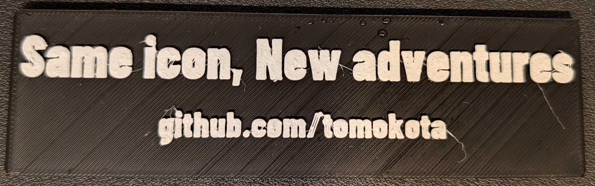

**報告日：2026-09-22。** 2行の銘板を実際に作ったことで、
画面の見え方だけでは分かりにくかった文字内の孔・字間・表面の状態を確認するきっかけになりました。
0.2 mmノズルという情報は、この相談時の本人回答です。他の写真すべての印刷条件を示すものではありません。

その後、ユーザーは2行を維持し、下段を少し大きく、上段の孔に余裕を持たせ、
白い文字を厚くする方針を選びました。[採用した設計](NAMEPLATE-V2.md)は
上段12 mmを維持、下段8→10 mm、白の浮彫0.8→1.2 mm、黒2.4 mmと取付け基材は不変です。
これは**設計の値**で、写真から現物を測った結果ではありません。

### 2. 改訂後、銘板の試作について手応えの報告

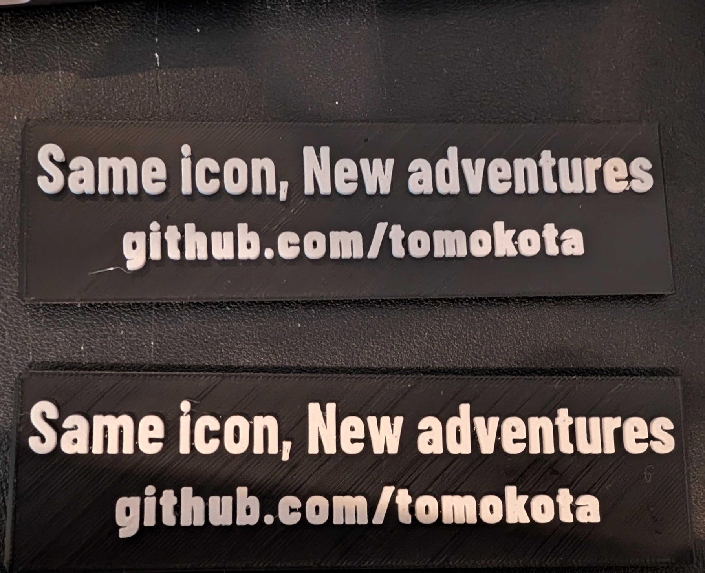

**報告日：2026-09-23。本人の言葉：「いけているみたい」。**
2枚の実物が並んだ写真と、制作が進められそうという手応えが届きました。
上・下のどちらを旧版／新版と呼べるかは未照合なので、断定ラベルは付けません。
この報告を、特定のSTL版の印刷合格や、糸引き・表面荒れの完全解消とは扱いません。

### 3. 黒い台座の積層・継ぎ目と、前面の空き領域

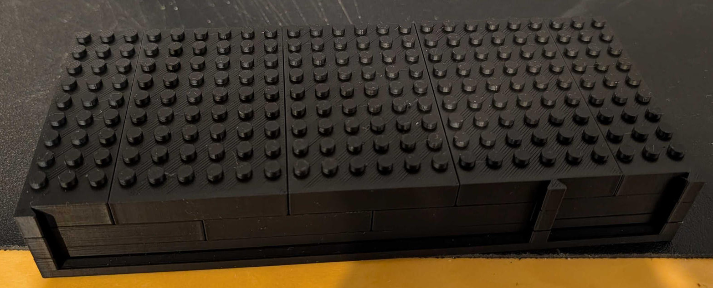

**報告日：2026-09-23。** 台座の積層と継ぎ目、上面のスタッド、
前面部品を入れる領域が見える写真です。
「ファイルを印刷する」から「台座の形に組む」へ進んだ様子が分かります。
写真から正確な段数・部品数・クリアランス値を補ってはいません。
設計上の5段・台座19個は[組立手順](ASSEMBLY.md)の値として区別します。

### 4. 右側のロゴが入った状態

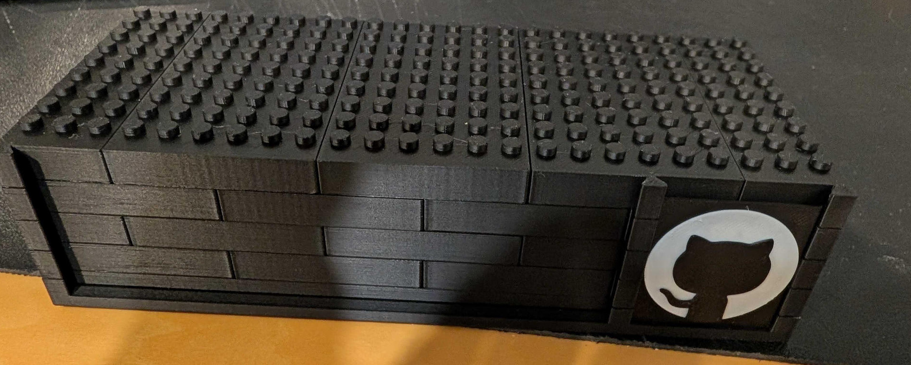

**報告日：2026-09-23。** 右側のロゴ部品が入った状態を確認できます。
左の銘板領域は空いています。掲載順は組み方を理解しやすい順であり、
この写真が他の写真より先に撮影されたという意味ではありません。
差し込む操作、必要な力、保持力、何回着脱できたかは写っていません。

### 5. 個人銘板と右ロゴを取り付けた土台へ

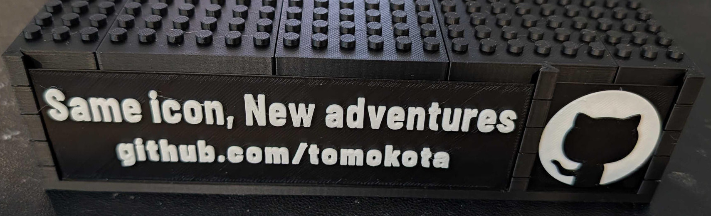

**報告日：2026-09-23。本人の言葉：「土台が組み上がりました」。**
前面に2行の個人銘板と右ロゴがそろった状態です。
今回は**台座と前面部品の実制作マイルストーン**として記録します。
写真だけで無接着を証明したり、keeperの保持・分解耐久・完成模型の安定性が合格したとは言いません。
**9/23時点**では顔・ゴーグル・完成150部品全体の制作写真は未提供でした。
その後の顔下部の進捗は、下の[9/24追記](#progress-2026-09-24)として区別しています。

## 補足ギャラリー — 同じ進捗の別角度も含む

台座の上面・側面・前面を、あと4枚で見る

**上面側。報告日：2026-09-23。** スタッドと継ぎ目を確認できます。寸法・段数の実測記録ではありません。

**側面側。報告日：2026-09-23。** 同じ進捗を別角度から写した可能性があります。未撮影の組立操作を補う写真ではありません。

**前面の詳細。報告日：2026-09-23。** 継ぎ目と取付け領域が見えます。写真の画素から嵌合公差は算定しません。

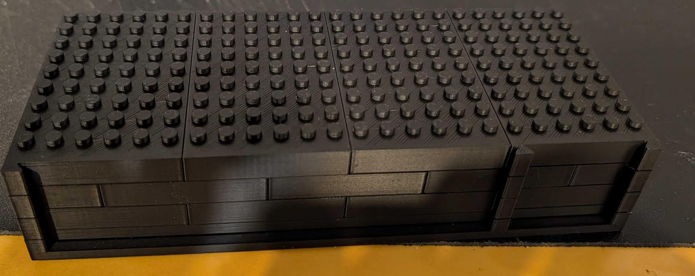

**前面全景。報告日：2026-09-23。** 前面部品が入っていない状態です。写真の番号・掲載順は撮影時刻の順番を保証しません。

## 2026-09-24 — 土台の上へ、顔下部を組む途中記録

本人の言葉：**「こちらは組み立ての途中記録になります」。**
銘板・右ロゴを取り付けた土台の上へ部品を積み、顔下部の輪郭が立ち上がってきました。
以下は理解しやすい**説明順**です。添付順や元ファイルの時刻を撮影順・正式なCAD工程番号に変換していません。
同じ進捗を別角度から撮った写真も含みます。

**色も観察と設計を分けます。** 実写真では紫と黄色に見える部品があります。
設計データのマゼンタ／緑を変更したものではなく、この記録追加でSTL・BOM・3Dの配色を変えていません。
部品を探すときは[3D工程](../guide/index.html)や[工程表](STEPS.md)を参考にできますが、
写真だけで特定の`B-xxx`や正確な部品数・工程番号を認定しません。

### 1. 土台の上に、紫の低い横並び

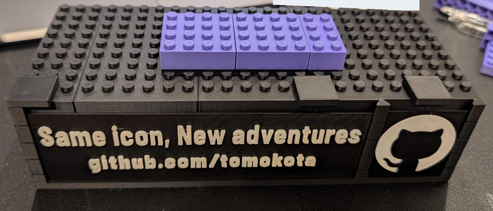

**報告日：2026-09-24。** 銘板と右ロゴの付いた土台の上に、
紫の低いパーツが横並びに載った状態です。
台座から顔側へ組立が進み始めた見え方として記録し、実際に何個追加したかは写真から補いません。

### 2. 黒い層と、紫の左右の段付き輪郭

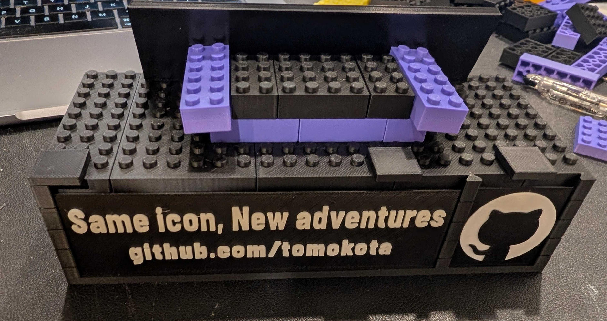

**報告日：2026-09-24。** 黒い層の左右に紫の段付き輪郭が見え、
顔下部が土台より上へ立ち上がってきた状態です。
写真で確認できるのはこの途中形状で、上部ゴーグルが完成した状態ではありません。

### 3. 黄色い縦2列が入った顔下部

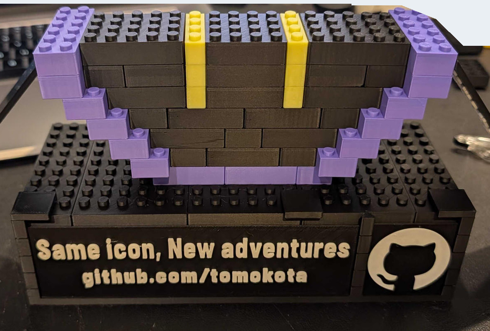

**報告日：2026-09-24。** 黒い顔下部の中に黄色い縦2列が見えます。
写真の見た目をそのまま記述しており、設計上の緑色の部品を黄色へ変更する指示にはしていません。
材料の銘柄や色名、使用した印刷ファイルの版までは未照合です。

### 4. その上へ黒い列を加えた状態

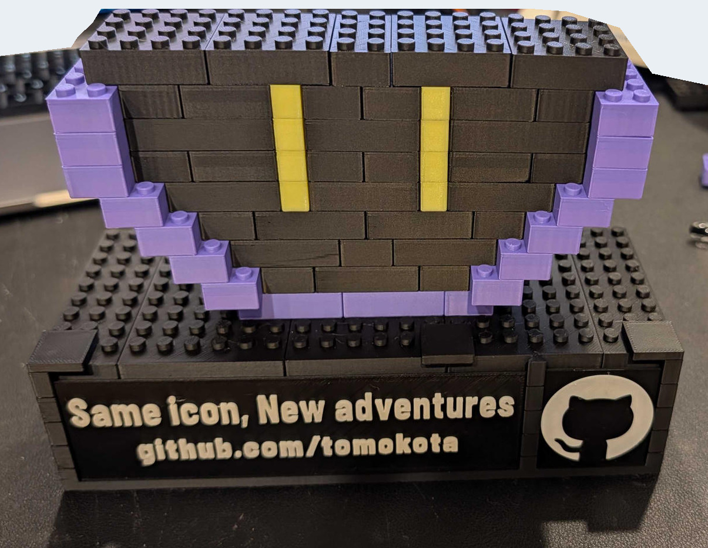

**報告日：2026-09-24。** 黄色い縦2列の上に黒い列が加わった状態が写っています。
**9/24の記録**はここまでの顔下部の組立途中です。当日の写真には上部ゴーグル・頭頂は写っておらず、
全150部品の完成や模型全体の強度・保持・転倒の合格へ広げません。

9/24の近い状態を、補足の3枚で見る

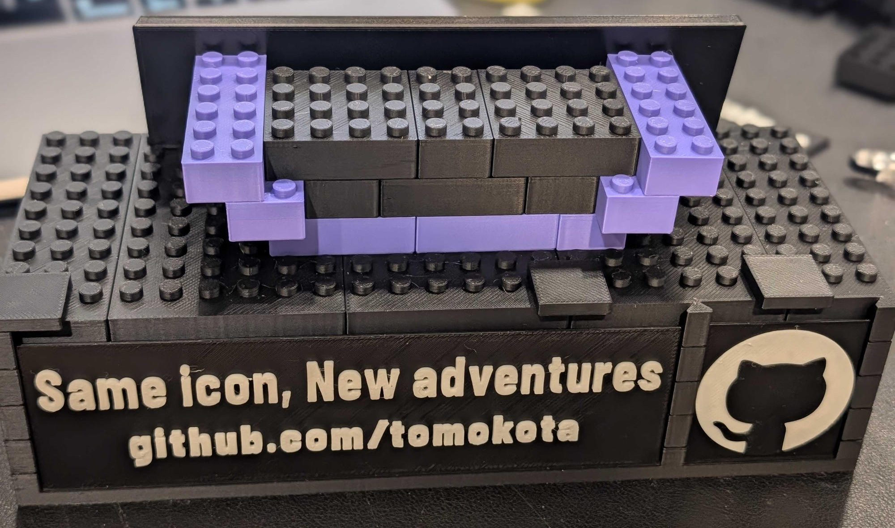

**顔下部の詳細。報告日：2026-09-24。** 継ぎ目と左右の輪郭を見られる角度です。
上の写真と別工程だったとは断定しません。

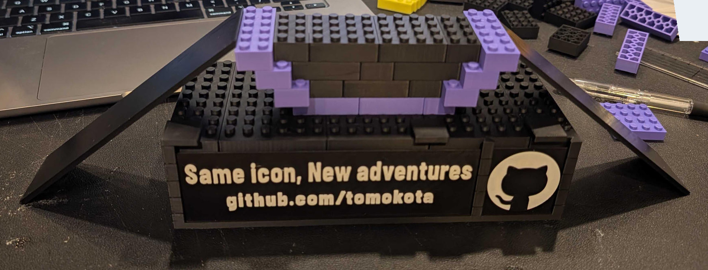

**少し離れた角度。報告日：2026-09-24。** 周囲の板状物も写っています。
その用途や固定方法を、写真から推定して部品表へ追加することはしません。

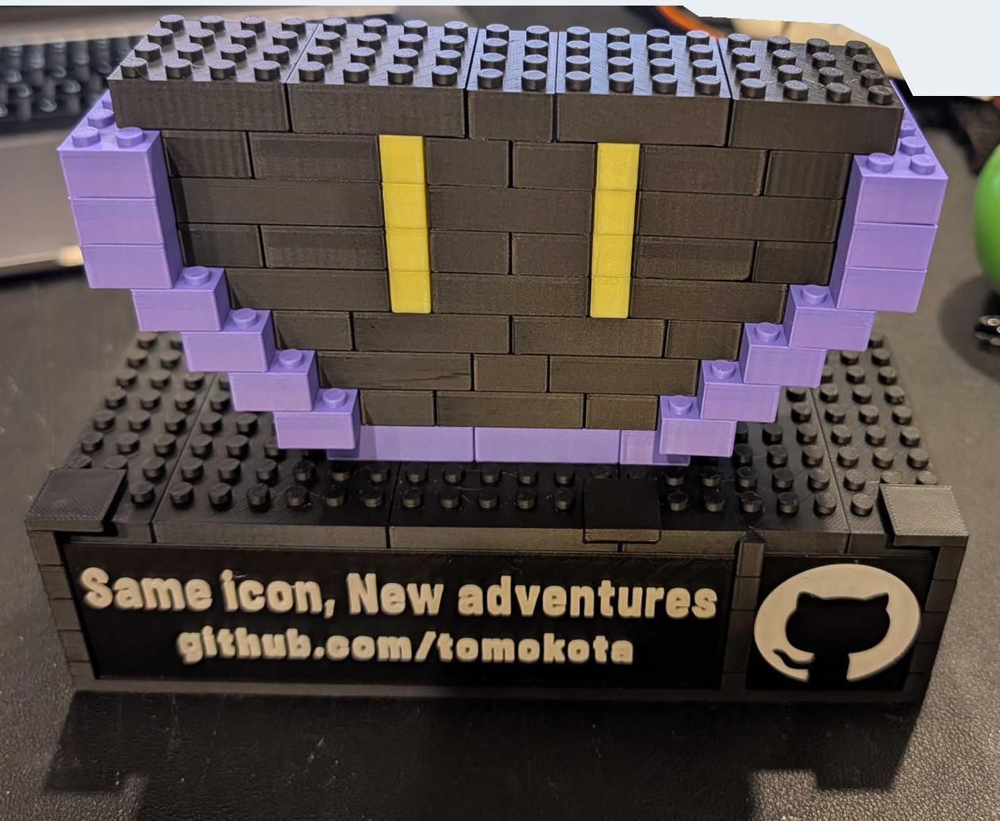

**上の黒い列がある状態の別角度。報告日：2026-09-24。**
同じ進捗の補足写真として扱い、新しい独立した工程や完成写真には数えません。

#### 写り込みと未確認事項

一部には背面に立つ黒い板や、左右へ斜めに置かれた板状物も写っています。
用途・材質・固定方法は説明されていないため、保持具・構造部材・同梱パーツ・失敗対策等とは断定しません。
造形物やこれらの板状物を、写真から都合よく消す加工はしていません。

9/24時点で前の9/23記録から分かったのは、顔下部の実制作が途中まで進んだということです。
接着の有無、各接続の保持力、荷重、寸法公差、着脱寿命、実スライスとの版対応は引き続き未確認です。

## 2026-09-25 — ゴーグルを組み、頭頂までそろって完成

本人の言葉：**「制作過程の写真です」**、そして **「これで完成ですね」**。
前日の顔下部から、水色のゴーグル枠が立ち上がり、最後に上枠と紫の頭頂がそろいました。
文字の試作から一つずつ積み上げてきたBが、ついに形になりました。完成おめでとうございます。

以下は実写真でたどる4つの説明段階です。近い状態の別角度も含むため、
8枚を8つの正式なCAD工程とは数えず、撮影時刻や厳密な前後関係も推測していません。
日付はすべて**報告日2026-09-25**です。

### 1. 水色のゴーグル下縁と側支柱が加わる

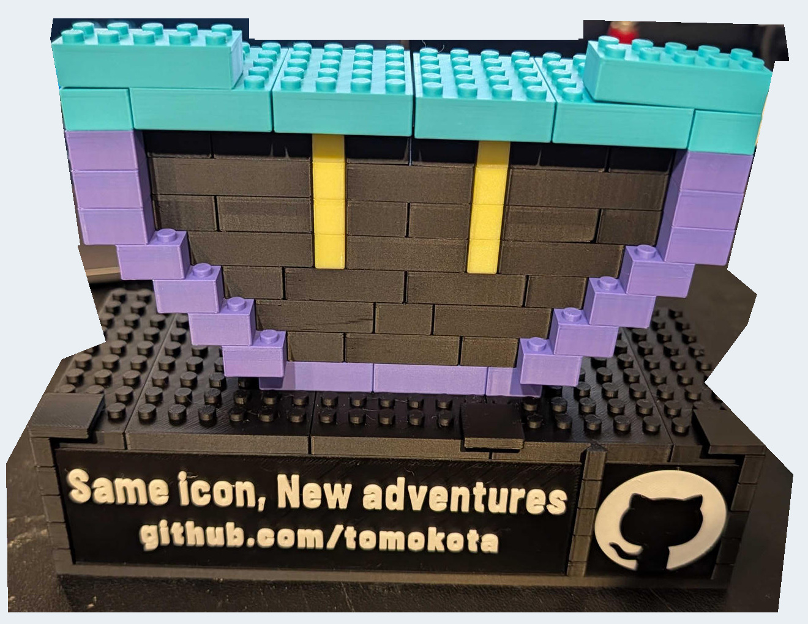

顔下部の上にシアン／水色の下縁が横に伸び、左右に支柱が立った状態です。
それまでの紫の輪郭と黄色い縦2列の上へ、ゴーグルの形が見えてきました。

### 2. 左右の黒い領域と中央の水色列を積む

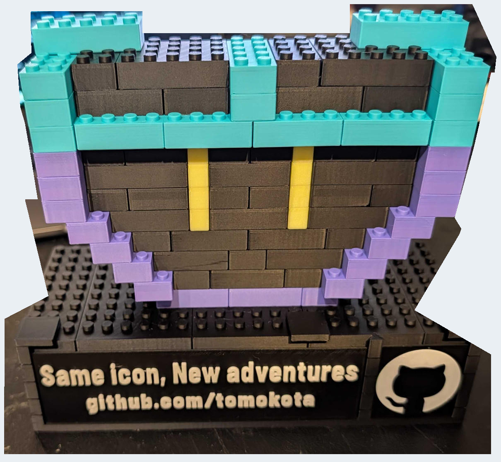

左右の黒い領域と、その間のシアン／水色の列が高くなる途中です。
外周と中央の列を見比べながら、顔の上半分が立ち上がっていく様子を記録します。

### 3. 上部が開いた、高いゴーグル枠

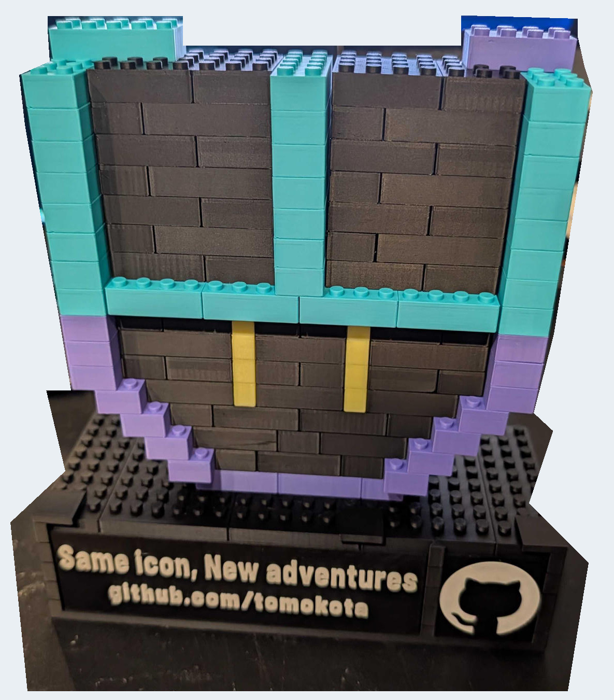

側面と中央が高くなり、まだ上部が開いている状態です。
仕上げの上枠を取り付ける前の姿として、完成写真と並べて見ることができます。

### 4. 上枠と紫の頭頂までそろって完成

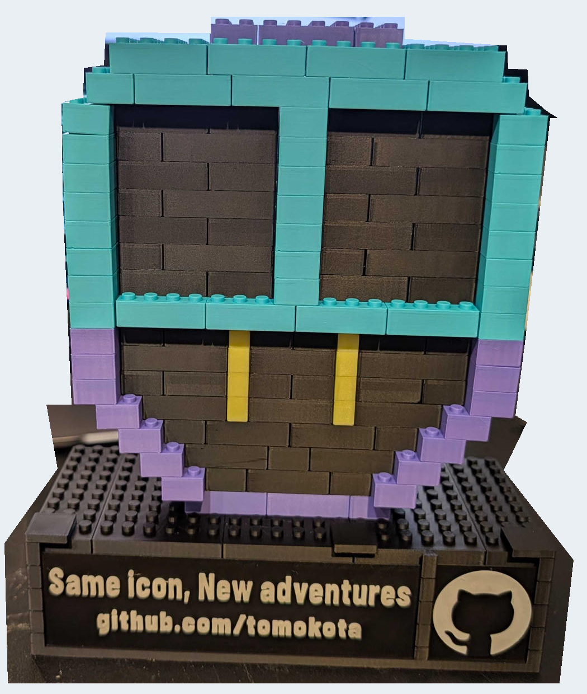

ゴーグルの上枠が閉じ、紫の頭頂パーツまでそろっています。
銘板と右ロゴのある台座から頭頂まで写った姿と、本人の「これで完成ですね」という言葉を、
今回の完成記録として残します。

**実物の完成写真です。** 背景PC画面などを隠すため、輪郭の周囲に薄グレーの不透明マスクが入っています。
撮って出しではありませんが、模型の色・印刷線・糸・隙間を修復したり、CGで補完したりしていません。

9/25の組立過程を、補足の4枚で見る

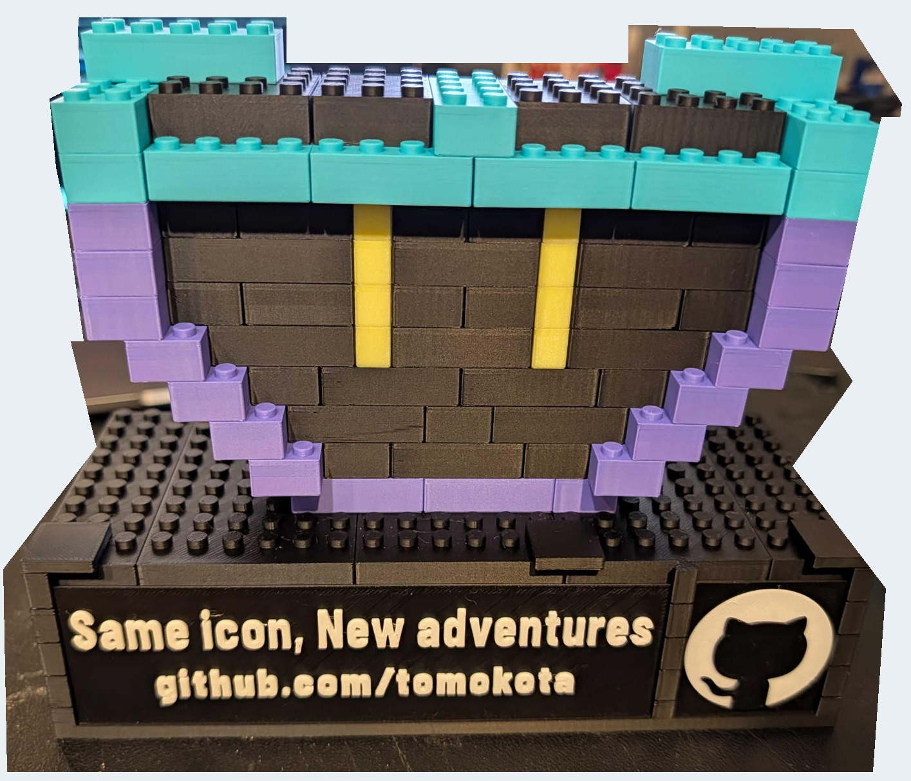

**下縁から上へ。報告日：2026-09-25。** 側面と中央の列の間に黒いブロックが見えます。
正式な工程番号を決めるためではなく、この時点の見え方を残す写真です。

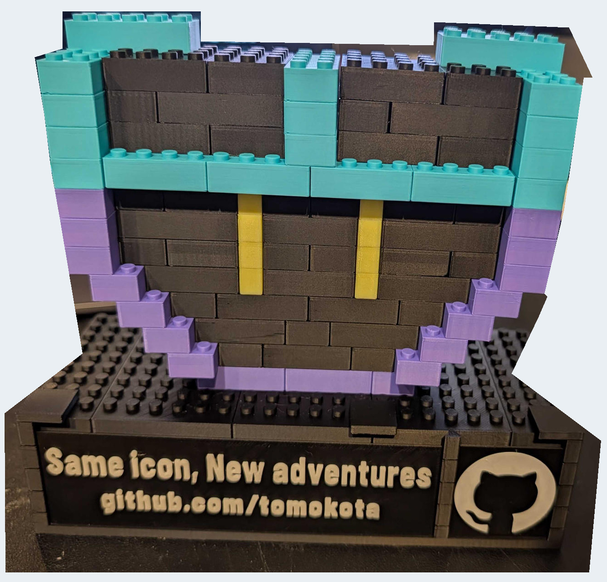

**左右の領域を別角度から。報告日：2026-09-25。**
似た状態の写真もあり、それぞれを独立した工程とは数えていません。

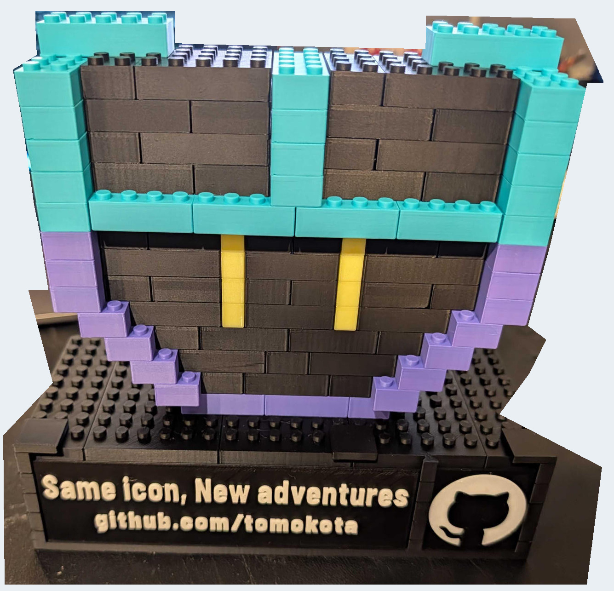

**高くなったゴーグル部分。報告日：2026-09-25。**
黒い面と中央の列が上へ伸びています。上枠を閉じる前の姿です。

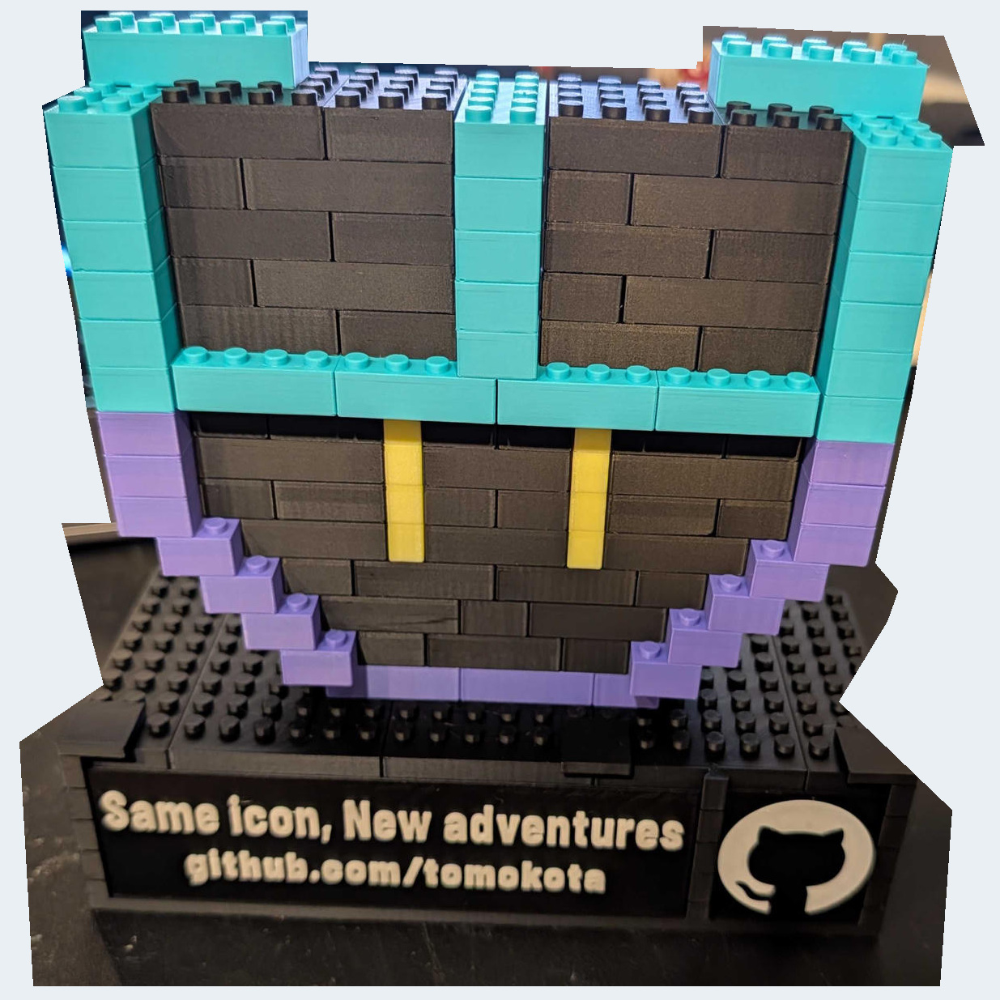

**頭頂の仕上げ前。報告日：2026-09-25。**
完成写真に至る途中の姿として残しています。掲載順は撮影時刻の証明ではありません。

写真の紫・黄色は実制作の配色です。設計データのマゼンタ・緑を書き換えたものではありません。
画面の完成CGは引き続きCGとして区別し、ここには実物写真を掲載しています。

#### 印刷後の後処理：超音波洗浄（ユーザー提供動画）

公開タイトル：**3Dプリント後のパーツを超音波洗浄｜Ultrasonic Cleaning of 3D-Printed Parts**

<a href="https://youtu.be/Lc_enNE3nng" target="_blank" rel="noopener noreferrer">YouTubeで動画を見る（新しいタブ）</a>

ユーザーから「3D Print後の超音波洗浄」として紹介された、実制作の参考動画です。
洗浄条件や結果をこちらで確認したものではなく、必須の印刷手順や検証済みの洗浄レシピではありません。
上の写真に洗浄の様子が写っているという意味でもありません。

**視聴にはインターネット接続が必要です。** 保存したオフライン記録でも、
このリンクを選んだときだけ外部のYouTubeを開きます。
動画やサムネイルは同梱・再配信せず、このページの表示だけではYouTubeへ通信しません。

## 学びと、次に残る確認

実物の文字相談から設計を見直し、その後に手応えの報告と台座・前面の写真、
9/24の顔下部の途中、9/25のゴーグル・頭頂と完成へ続く制作の流れを残しました。
写真と本人の言葉を通して、部品が少しずつ模型になっていく過程を振り返れます。

| 残した実制作の記録 | 記録の位置づけ |
|---|---|
| 文字の相談、改訂と試作についての手応え | 本人の感想と実写真。印刷条件による効果の測定とは別 |
| 土台と前面、顔下部、ゴーグルの組立過程 | 日付別の写真観察。写真番号を正式CAD工程や撮影時刻に置き換えない |
| 上枠と紫の頭頂までそろった写真と「これで完成ですね」 | 本人の完成報告と、完成した姿の実制作記録 |

**設計・測定との区別：** 完成の報告を、写真だけで150個を個別検品した結果、
寸法・荷重・耐久・転倒の測定合格、使用STL／実スライスの版・hash照合とはしていません。
それらの記録は未提供です。制作の完成を否定するものではなく、記録の種類を分けています。
この制作記録の追加で、STL・3MF・native・150配置や、黒→白の境界を変更していません。
配布データは引き続き**NOT_SLICED**です。
作業を進める際は[印刷手順](PRINTING.md)・[少量試作](TRIAL.md)・[組立手順](ASSEMBLY.md)を参照し、
強い力、白化・割れ、着座不良や保持不足があれば止めてください。

## 写真の取扱い

写真の権利はユーザーに帰属します。今回の掲載許可は、モデル・フォント・ソフトウェアのライセンスを
写真へ自動適用したり、第三者へ包括的な再利用権を与えたりするものではありません。
この個人版には許可された銘板の文字を残し、無関係な背景を可能な範囲で切り取っています。
2026-09-23の追加承認により、個人版repoとこの案内ページも公開対象になりました。
一般向けrepoの伏字画像とは別系統です。加工前の原画像・EXIF・監査元パスは公開しません。

9/24の新しい7枚についても、個人版は銘板の文面を残し、一般向け版は個人URLを伏せ、
両方で背景PC画面と撮影メタデータを除去する形での掲載を、本人が別途承認しています。
親担当が一度だけ加工した派生をそのまま取り込み、このrepo内で再加工していません。
9/25の制作過程・完成の8枚も、同じ公開範囲で制作記録へ追記することを本人が承認しています。
背景の切り取り・必要なマスクなどの加工内容は、各日のmanifestに記録しています。

このページに含むのは加工済みの実写真**24枚（9/23までの9枚＋9/24の7枚＋9/25の8枚）**です。元ファイル名・EXIF・位置・カメラ情報、
加工前の原画像、監査用の元パス対応表は収録していません。
[9/23までの画像一覧](images/build-log-2026-09-23/manifest.json)、
[9/24の画像一覧](images/build-log-2026-09-24/manifest.json)、
[9/25の画像一覧](images/build-log-2026-09-25/manifest.json)には、
中立ID・報告日・寸法・配布画像のhash・回転／切り取り／メタデータ除去の範囲など、
配布用の情報を記録しています。
写真のスライドショーを実組立動画と称していません。
