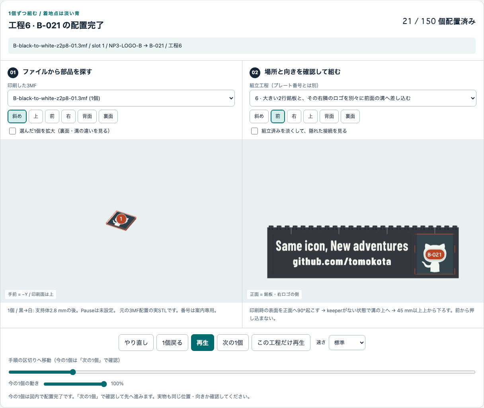

# 印刷した部品を探す・3Dで組み方を見る

[実写真の制作記録](BUILD-LOG.md)／[オフライン閲覧版](BUILD-LOG.html)も追加しました。
台座・前面、顔下部に続く[9/25のゴーグル・頭頂と完成の写真](BUILD-LOG.md#progress-2026-09-25)も含め、
本人の「これで完成ですね」という報告と実物写真を、CGの工程表示とは別に記録しています。
3D画面上部からも開けます。写真を読む場合はZIP全体を展開してください。

2026-09-22承認の新しい銘板を3D・画像・アニメにも反映しています。
前の版から変更したのは文字銘板だけです。[文字試験片と変更点](NAMEPLATE-V2.md)を先に確認し、
台座・顔・右ロゴをこの更新のために刷り直す必要はありません。

[入口](../README.md) · [3Dガイドを開く](../guide/index.html) · [全ファイル対応](FILES.md) · [全工程](STEPS.md)

## ZIPを展開してダブルクリック

保存したZIPを展開し、**`guide/index.html`をブラウザで開きます**。
HTML内に表示用ランタイム、実STL由来のメッシュ、全14枚／150配置のデータを同梱しています。
見るだけならインターネット、Python、Node、FreeCAD、サーバーは不要です。
GitHubのファイル画面やZIPの中から直接開かず、展開済みファイルを使ってください。
フォルダをコピーして別PCへ移しても、個人データを外へ送らず閲覧できます。

WebGLが使える最近のChrome／Edge／Firefox／Safariなどのブラウザが必要です。
3D表示に失敗したら画面のエラーを確認し、WebGL対応ブラウザで開き直します。
安全警告や組織の端末制限を解除する必要はありません。
表示できない端末では、同梱の[工程図](STEPS.md)と[PDF](../kit/B/drawings.pdf)を使います。

## 1. 最初の大きい1枚を探す

**印刷順と組立順は別です。色表やファイル名の01から積み始めません。**

1. 印刷ファイルで **`B-black-02.3mf`** を選びます。
2. プレート上の一番大きい **slot 3** を選びます。一覧からも選択できます。
3. `BASE3-24x10-B-562406`、**191.8 × 79.8 mm**、1個、
   **`B-001`／工程1**という対応を確認します。
4. 組立を空の状態から進め、この広い1枚を机へ置く様子を見ます。
   2段目以降は小さい部品を順に載せます。


`B-black-01.3mf`を先に印刷済みなら、その8個は2〜5段目へ取っておきます。
同じ左端形状2個は3段目・5段目用で、左右ペアではありません。
この理由だけで廃棄・再印刷はしません。

## 2. slot・部品ID・配置番号の違い

| 表示 | 意味 |
|---|---|
| `B-black-02.3mf` | どの印刷ファイルから取るか。ガイドはその実3MFの配置を読み取っています |
| slot 3 | その3MF内の3番目。**案内用の番号で刻印なし**。スライサーの独自番号と同じとは限りません |
| `BASE3-24x10-B-562406` | 形状の部品ID。寸法だけでなく、末尾まで一致することを確認します |
| `B-001` | 完成Bのどこに置く1個かを示す配置番号 |
| 工程1 | 組立に追加する段階。印刷順ではありません |

同じ**部品IDと色**のものは同形・可換です。ガイドには全適用候補と、
150個を過不足なく数えるための便宜上の割当があります。
印刷した特定の実物が特定の配置専用品だとは断定していません。
他のslotや試作から同形・同色の良品を使った場合は、必要数から差し引いてください。
色が違うもの、外寸が同じでも末尾の異なるものは、同じ部品ではありません。

台座の6×10部品は似ていますが、銘板／ロゴの溝形状が異なります。
プレートと組立を回転・拡大し、**正面の溝と下面、端の形**を見比べます。
3Dで見えた穴の有無だけを理由に実物を削らず、部品IDと[寸法図](FILES.md)を照合してください。

## 3. 空の机から全28工程へ

前／次、再生／停止、工程の選択、工程再生、やり直しで進めます。
工程を移動したら再生は停止し、選んだ工程の状態へ切り替わります。
既に置いた部品は残り、その工程の部品だけが順に加わります。
回転・ズーム、前／右／上の視点で接続を確認できます。
完成位置の強調表示と途中の組立表示を使い分けてください。
オレンジの枠や淡い着地点は案内用の表示で、フィラメント色や追加の部品ではありません。
「今の1個の動き」を100%にすると、その1個は図内で配置完了になり、表示個数に含まれます。
「次の1個」で確認して先へ進めます。スライダーの区切りや図内の完了表示は、
実物の作業・保持試験が済んだことを記録するものではありません。
ボタンや一覧はTabで選び、Enter／Spaceで操作できます。3Dのマウス選択だけに頼りません。

| 工程 | 内容・追加数 | 案内上の出処 |
|---|---|---|
| 1 | 幅191.8 mmの1段目、1個 | black-02 slot 3 |
| 2〜5 | 継ぎ目をずらして台座を5段へ、計18個 | black-01〜04。2段目にも01・02・03すべてが必要 |
| 6 | 左の個人銘板と右の独立ロゴ、2個 | black-to-white-z2p4／z2p8の各slot 1 |
| 7 | 2列目へkeeper、3個 | black-07 slot 8〜10 |
| 8〜26 | 顔19段、計123個 | その工程に表示される部品・色・3MFを確認 |
| 27 | 頭頂マゼンタ、3個 | マゼンタの該当slot |
| 28 | 保持・浮き・転倒の確認、追加0個 | 累計150個 |


この動画は空から台座5段・前面2部品・keeper3個が追加される様子です。
全体を回すだけの動画ではありません。全150個は操作できる[3Dガイド](../guide/index.html)で確認します。
プレートの配置やassemblyの位置・回転は実データを使いますが、
持ち上げて見せる移動や分解・透過表示は説明用です。
**衝突回避、挿入力、保持、分解経路の物理保証ではありません。**

## 4. 前面の向き・色・数量を間違えない

銘板とロゴは印刷では裏面を下にして平置きします。
組立では実データどおりX軸まわりに90度回し、文字／ロゴを手前に向け、
台座前面の独立した溝へ上から入れます。前から押し込む方式ではありません。



銘板は `B-black-to-white-z2p4-01.3mf` slot 1 → `NP3-TEXT-B` → `B-020`、
右ロゴは `B-black-to-white-z2p8-01.3mf` slot 1 → `NP3-LOGO-B` → `B-021`。
どちらも工程6です。続く工程7のkeeper3個はblack-07 slot 8〜10 → `B-022`〜`B-024`です。

個人銘板は`NP3-TEXT-B`の1枚、**142 × 40 × 3.6 mm**、
黒の支持体2.4 mm＋白レリーフ1.2 mmです。実際の行の文字高さは12／10 mmです。
ロゴは黒の支持体2.8 mmの後に白となります。
ガイドの配色は形状の高さ境界を示すもので、Pauseや実レイヤー番号を設定しません。
正確な文字は次の2行だけです。

```text
Same icon, New adventures
github.com/tomokota
```

個人銘板は汎用版への**置換1枚**であり、追加ではありません。
完成品は**150個、191.8 × 80.2 × 238.6 mm、黒台座5段48 mm**です。
個数・台座寸法・配置はそのまま、増した白文字だけが0.4 mm前に出ます。
fit試験片と7個の試作セットは別区分です。試作の2×2ブロック2個は完成BOMに含まれません。
他の試作良品は部品ID・色・必要数を確認して流用し、重複印刷を避けます。

## デジタルの案内と実物の安全を分ける

配布データは**NOT_SLICED**です。制作過程と完成写真・本人の完成報告はありますが、
使用版・設定の照合、嵌合、保持、強度、転倒、途中色替え手順の正式な評価結果は未提供です。
今回の旧銘板の実ノズルは0.2 mmとの申告があります。新版の印刷条件は未照合で、
実ノズルとStudio設定、PLA、plate、profileは本人が確認します。
このガイドはプリンタ接続、Send／Print、設定変更を行いません。
穴・溝の閉塞、指でつかめない、座らない、強い力が必要、割れ、保持不足があれば停止し、
[少量試作](TRIAL.md)と[印刷時の点検](PRINTING.md)へ戻ります。
