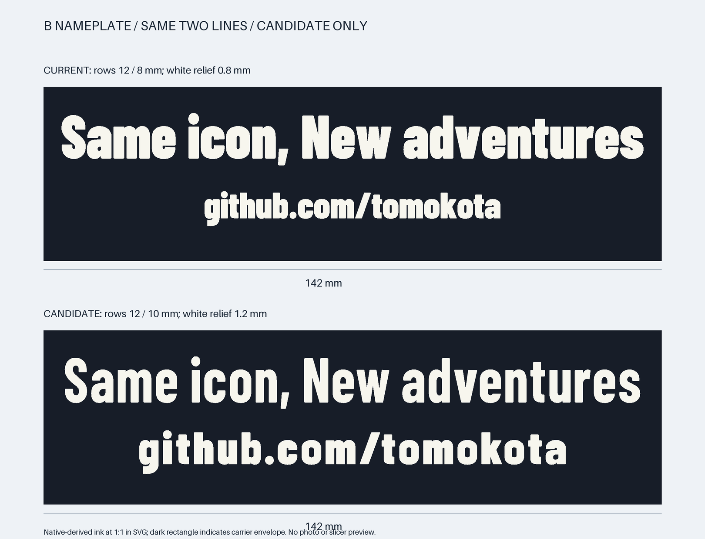
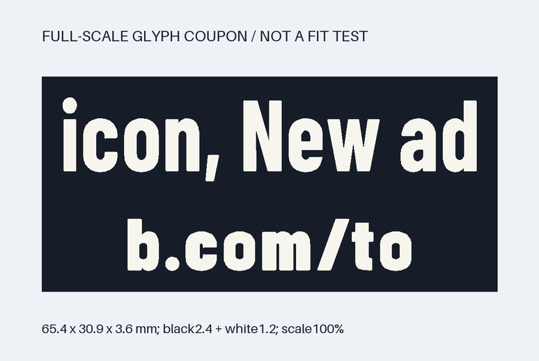
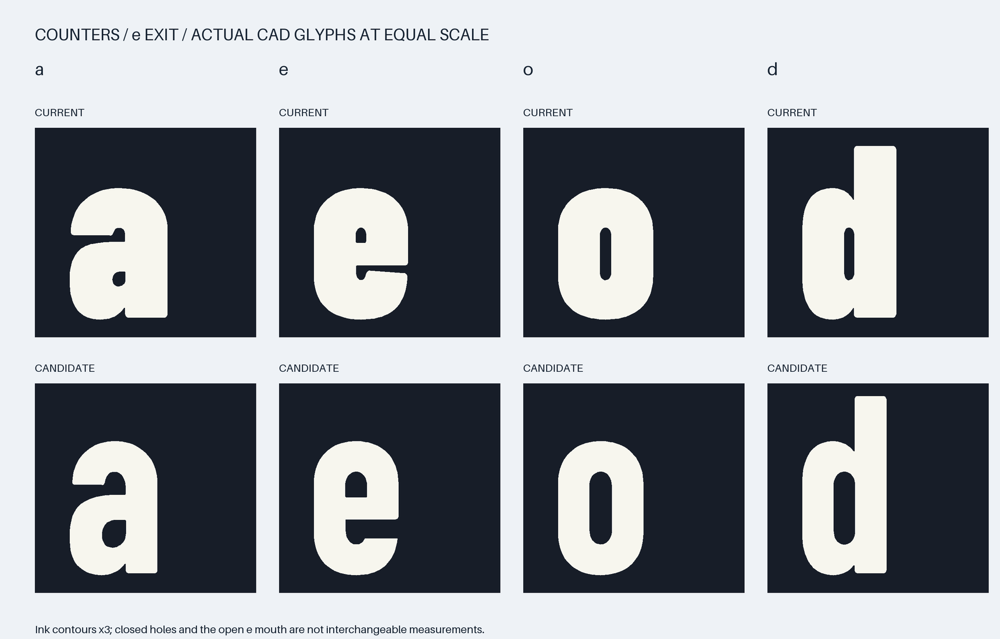
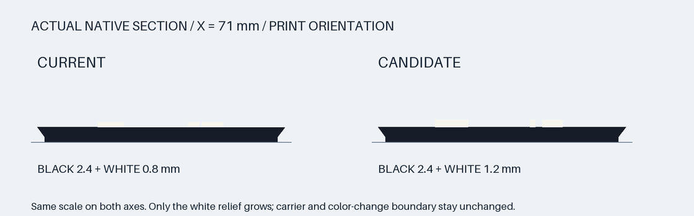

# 文字銘板の更新 — 2行のまま、孔と字間を広げる

[入口](../README.md) · [印刷手順](PRINTING.md) · [組立・交換](ASSEMBLY.md)

**2026-09-22に比較図で承認された版を、現行`NP3-TEXT-B`へ反映しました。**
再印刷対象は文字銘板1枚だけです。台座・顔・右ロゴ・keeperの印刷形状と配置は変えていません。
完成品は150個のままで、下の文字試験片はその個数に足しません。

## 先に小さい試験片を1個

| 保存するもの | 用途 |
|---|---|
| [文字試験片3MF](../samples/nameplate-v2/NP3-LETTER-TEST-B-V2.3mf) | まずこちらを1個。65.4×30.9×3.6 mm、黒2.4＋白1.2 mm |
| [文字試験片STL](../samples/nameplate-v2/NP3-LETTER-TEST-B-V2.stl) | 同じ1個の代替形式。上の3MFと同時に読み込まない |
| [新版銘板3MF](../kit/B/plates/B-black-to-white-z2p4-01.3mf) | 小試験後の全文142×40×3.6 mm、1個 |
| [新版銘板STL](../kit/B/parts/NP3-TEXT-B.stl) | 同じ全文1個の代替形式 |

試験片は実際の新版から **`icon, New ad` と `b.com/to`** を切り出したもので、
文字の大きさ・字間・黒白の高さは全文銘板と同じです。上段のa/e/o/d、eの出口、
下段のb/o、点、スラッシュ、mの接合部を見られます。
取付けキーのない単純な裏板です。これが良くても、全文板の反り・嵌合・保持の合格ではありません。

P1Sの実装ノズルとStudioの**0.2 mm設定が一致**することを確認し、
mm・100%、平らな裏面を下、文字を上で1個ずつ使います。
どちらも**NOT_SLICED**で、Pause・プリンタprofile・G-codeは含みません。
黒2.4 mmが終わった後、最初の白い経路の前にPauseを入れるルールは変更ありません。
固定層番号には置き換えず、実レイヤープレビューで確認してください。

## 何を変えたか

| 項目 | 旧版 | 新版 |
|---|---:|---:|
| 上段の実ink高さ | 12 mm | **12 mmを維持** |
| 下段の実ink高さ | 8 mm | **10 mm** |
| 白の浮彫高さ | 0.8 mm | **1.2 mm** |
| 黒の基材厚さ | 2.4 mm | **2.4 mmのまま** |
| 銘板全厚 | 3.2 mm | **3.6 mm** |
| 上段の最小字間・実BRep距離 | 0.342 mm | **1.048 mm** |
| 下段の最小字間・実BRep距離 | 0.172 mm | **1.048 mm** |
| 上下の実ink間隔 | 6 mm | **5 mm** |

「ink高さ」はフォントのポイント数ではなく、点やカンマ等を含む各行の実文字形状の外接高さです。
下段は均等拡大です。上段は横方向のフォント尺度を保ち、従来と同様に実高さ12 mmへ合わせています。
幅へ押し込む横圧縮、文字削除、URL短縮、3行化はしていません。

上段は同じBarlow CondensedのBoldへ替え、eの右の口を広げています。
下段はBlackの正線を残しながら、内側の孔だけを広げました。
不足する字間だけを追加し、元のkerningを縮めていません。
白を厚くしたのは板から出る方向であり、白い文字を横太りさせたものではありません。

代表的な閉孔の**中央50%帯の最小横chord**は、上段aが0.655→1.203 mm、
eが0.501→1.040 mm、oが0.628→1.267 mm、dが0.563→1.203 mmです。
eの右へ通じる有効開口は約0.32→1.10 mm、下段g/b/oの同chordは最低約1.02 mmです。

正の材料幅も別に測っています。平行直線のgauge最小値は上段1.261 mm／下段1.694 mm。
曲線を含む持続的な細い接合を調べる「材料coreが分裂する侵食径」は、
定義した面積条件で上段最低約1.09 mm／下段約1.02 mmです。
点やスラッシュを含めた[測定記録と定義](../verification/legibility-metrics.json)を残しています。

これらは**今回の候補を比較する設計上の目安**です。0.2 mmノズルの保証規格ではありません。
孔の尖った端へ近づいた数学上のゼロ幅を「最小孔径」と数えず、
中央25〜75%を通る横・縦101本のchordと内接円径を区別しています。
e/cの開口は0.01 mm格子で外へ抜ける最大clearance経路を測り、誤差目安は約±0.03 mm。
正線gaugeも曲線先端の全箇所保証ではありません。

## 黒い取付けと交換手順は維持

黒いキャリアと裏のキーテーパー・座面は旧版と実BRepの体積対称差0です。
差替えた状態、keeperを上6 mm→前32 mmへ外す操作、
銘板を上45 mm→前14 mmへ抜く操作について、
連続掃引または形状を包む保守的な包絡を使い、デジタル干渉0を確認しました。
実物は軽い指の力で試し、強い力・白化・割れ・保持不足があれば止めます。

増した白が0.4 mm前へ出るため、完成模型の外接寸法は**191.8×80.2×238.6 mm**です。
台座の191.8×79.8 mmと5段48 mm、150個の配置は変わりません。
この図はスライス結果でも物理的な成功証明でもありません。

## 写真から分かること・まだ分からないこと

2026-09-23に、銘板2枚の写真と「いけているみたい」、その後に
「土台が組み上がりました」という報告・写真が届きました。
[制作記録](BUILD-LOG.md)に、改訂後の試作についての手応えと台座・前面の状態をまとめています。
2枚の上下の旧・新版対応、各現物と指定STL／実スライスのhashは未照合です。
9/24には、銘板・右ロゴ付き台座の上へ顔下部を組む[途中記録](BUILD-LOG.md#progress-2026-09-24)が追加されました。
これは文字銘板の再改訂や、使用版・印刷条件の合格認定ではありません。

旧銘板を0.2 mmノズルで印刷したとの申告と写真が、この変更の起点です。
狭い孔・字間の余裕を増やしましたが、糸引き・上面の荒れ・線状の抜けを
形状だけで解消できるとは断定しません。実際の設定入りBambu Studioプロジェクトは未受領です。
温度、流量、乾燥、冷却の値を写真だけで推測して一律変更しないでください。

試験片で孔が閉じる、文字経路が欠ける、上面が荒れる場合は全文の再印刷を止め、
実プレビューと現物を照合します。写真は銘板を印刷した証拠であり、
完成模型全体の保持・安定性や、特定の指定版が検証条件どおり成功したことを示すものではありません。
許可された加工済み写真だけを掲載し、加工前の原画像やEXIFはこのリポジトリへ保存していません。

旧版を確認する場合だけ、
[履歴用の旧銘板](https://github.com/ktanino10/copilot-brick-gift-b/tree/main/revisions/4.0-B-personal-kit.2)
を使います。現行の印刷対象に混ぜないでください。
