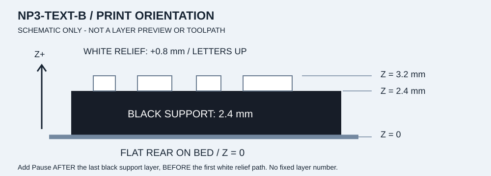

# 別のPCで印刷する

**銘板の2026-09-22更新：再印刷対象は文字銘板1枚だけです。**
現行`NP3-TEXT-B`は上12 mm／下10 mm、白1.2 mm、全厚3.6 mm。
台座・顔・右ロゴ・keeperは変更していません。既存部品を一律に刷り直さず、
まず[新しい文字試験片](NAMEPLATE-V2.md)で孔・字間・上面を確認してください。

[入口へ戻る](../README.md) · [3Dガイド](../guide/index.html) · [少量試作](TRIAL.md) · [組立・分解](ASSEMBLY.md)

このキットは **B DESK CLASSIC・個人銘板入りの1種類だけ**です。すべて
**NOT_SLICED（未スライス）**。配布3MFは形状と配置だけで、P1S設定入りの
Bambu Studioプロジェクト、Pause設定、G-codeではありません。
ユーザーによる文字試作と台座・前面の[実制作写真](BUILD-LOG.md)があります。
使用ファイル／実スライス版の照合、保持・寸法・荷重・転倒等の評価結果は未提供です。
写真があることと、配布3MFに実機設定やPauseが含まれることは別です。

**色別表は印刷用の仕分けであり、組立順ではありません。**
`B-black-01.3mf`から印刷しても構いませんが、その8個だけで1段目を作ることはできません。
最初の1段目は **`B-black-02.3mf` のslot 3、`BASE3-24x10-B-562406`、
191.8 × 79.8 mmの1枚 → `B-001`／工程1** です。
刷り上がった部品は捨てたり一律に再印刷したりせず、
[3Dガイドの仕分け手順](GUIDE.md)で部品IDと色を確認して保管します。

## 1. 別PCで見る・保存する

1. 別PCで[本人向けの公開案内](https://ktanino10.github.io/copilot-brick-gift-b/)を開くと、
   説明・作り方・3D工程・制作記録をそのまま読めます。閲覧にログインは不要です。
   印刷データを保存するときは、[公開リポジトリ](https://github.com/ktanino10/copilot-brick-gift-b)へ進みます。
2. **Code → Download ZIP** で全体を保存します。印刷用だけなら
   [B-personal-print-kit.zip](https://github.com/ktanino10/copilot-brick-gift-b/blob/main/downloads/B-personal-print-kit.zip)のファイル画面で
   **Download raw file** を選びます。どちらか一方で十分です。
3. エクスプローラー／FinderでZIPを**展開**します。ZIPを直接スライサーへ渡しません。
   展開後の `README.md` と `docs/` が、この説明のオフライン版です。
   **`guide/index.html`をダブルクリック**すると、実3MFの配置と組立の3Dガイドが開きます。
   閲覧にPython／Node／サーバー／ネット接続は不要です。
4. GitHubの閲覧HTMLを「ページとして保存」して `.stl` に改名しないでください。
   実ファイルの拡張子が `.zip`／`.3mf`／`.stl` かを確認します。
   閲覧ページのHTMLが保存された場合は、**Download raw file**から取り直します。

2026-09-23の承認により、個人版の案内をGitHub Pagesでも公開しています。
保存したZIP内の相対リンクも引き続き使えます。
ダウンロード時の一時的な署名付きURLを共有・ブックマークする必要はありません。

## 2. 用意するものと実機の確認

| 用意するもの | 確認すること |
|---|---|
| Bambu Lab P1S、Bambu Studio | **今、実際に装着されているノズル径**とプリンタプリセットが一致すること |
| PLA 5色 | ブラック、シアン、マゼンタ、グリーン、ホワイト。実際の銘柄・色に対応する設定を選ぶ |
| 使用するビルドプレート | 種類とメーカーの取扱手順。清掃・取り外しはその手順に従う |
| 平らな机、柔らかい布、色・ID別トレー | 小部品の落下・混同を防ぐ |
| ノギス | 外形・スタッド・反りの観察用。測定のばらつきも記録する |

接着剤、別ピン、ハンマーは不要です。AMSの有無は未確認ですが、以下は**AMSなしの
色別印刷＋前面2部品の手動色替え**で進める手順です。

本体に0.4 mm、文字・ロゴに0.2 mmノズルを推奨しますが、
**未実機検証の出発点**です。今回の旧銘板は0.2 mmノズルで印刷したとの申告があります。
新版の成功や次回の設定一致を意味しないので、印刷時の実装状態を改めて照合します。
交換する場合はP1Sのメーカー手順に従い、冷却・安全確保後に
行い、Studio側の設定も合わせ直します。

温度・流量・冷却・層高・線幅は、実際のPLA、プレート、ノズルに合う公式プリセットを
起点にします。ここでは成功済みのプロファイルや固定の補正値を指定していません。

## 3. 最初は2個だけ

最初に [FIT-M-D470.stl](../kit/fit/FIT-M-D470.stl) と
[FIT-F-CP12.stl](../kit/fit/FIT-F-CP12.stl) を**各1個**使います。
全数の本体プレートはまだ印刷しません。

1. 新しい空のプロジェクトで実P1S・実ノズル・PLA・プレートを選択します。
   一致するプリセットがなければ、別機種や別径で代用せず止めます。
2. 2つのSTLを読み込み、**mm・倍率100%・各1個**を確認します。
   提供された向きを保ち、下面がZ=0でベッドに接することを確認します。
3. スライス後、下記のレイヤー点検を行います。警告が理解できなければ印刷しません。
4. 設定を配布物とは別名の、ローカルのBambu Studioプロジェクトに保存します。
   記録には[空の記録表](../kit/fit-log.csv)をコピーして使えます。
5. 本人がプレビューと実機条件を確認してから、メーカーの通常操作で印刷します。
   このキットからプリンタへ自動接続・Send・Printはしません。
6. 十分冷まして取り出し、[少量試作の合否](TRIAL.md)を確認します。
   次は必要なキー溝試験片、実ブロック4個、keeperと台座端部の3個の順です。

STLは単位情報を持ちません。大きさを合わせるための拡大・縮小はしないでください。
8 mmピッチと嵌合寸法が変わります。

## 4. スライス後に見る場所

| プレビュー位置 | 印刷前に確認すること |
|---|---|
| 初層・穴入口 | 受けや溝を塞ぐ線、意図しない内側ブリムがない |
| 下面空洞の途中 | 内部へ不要なサポートや隣部品のブリムが入っていない |
| 屋根の最初の層 | ブリッジが必要なリブへ着地する。空洞を埋める経路になっていない |
| スタッド・薄壁・キー溝 | 必要な輪郭が連続し、細い経路が欠落していない |
| 文字・ロゴ | レリーフの最初から最後まで読める経路が残る |
| プレート全体 | 校正線、除外領域、外側ブリム、部品同士が干渉しない |

通常ブロックの屋根下面はおよそZ=8 mm、keeper後列受けの屋根下面はおよそ
Z=2.2 mmです。リブ・屋根は必要な材料です。台座最前列の中実の補強帯を、
本来あるはずの穴が塞がったものと取り違えて削らないでください。

**サポートを穴に自動で詰めないこと**が重要です。「後で全部取れる」と推測しません。
穴側を上へ反転して解決したことにもせず、提供姿勢で点検します。
時間・重量は本人の実スライスに表示された値だけを記録します。

## 5. B本体を色別に印刷する

[プレート一覧・数量](FILES.md)と[完成品BOM](../kit/B/bom.csv)を使います。
本体4色は単色で、白だけの独立部品はありません。
**以下の表の上から順に刷ることと、台座1段目から組むことは別です。**
色でまとめるのは材料交換を減らすためです。黒を刷った順に下から積める、という意味ではありません。

| 色／用途 | `kit/B/plates/` 内のファイル | 候補プレート数 | ノズル案 |
|---|---|---:|---|
| 黒・本体 | `B-black-01.3mf`〜`B-black-07.3mf` | 7 | 0.4 mm |
| シアン | `B-cyan-01.3mf`〜`B-cyan-02.3mf` | 2 | 0.4 mm |
| マゼンタ | `B-magenta-01.3mf`〜`B-magenta-02.3mf` | 2 | 0.4 mm |
| 緑 | `B-green-01.3mf` | 1 | 0.4 mm |
| 個人銘板・黒→白 | `B-black-to-white-z2p4-01.3mf` | 1 | 0.2 mm |
| 右ロゴ・黒→白 | `B-black-to-white-z2p8-01.3mf` | 1 | 0.2 mm |

各3MFは**1回分の候補配置**です。1つずつ新しい空のプレート／プロジェクトに
開き、前の配置へ追加しません。単色プレートでも収録部品・個数はそれぞれ異なります。
プレート数14は部品数150とは違います。

### black-01を既に刷った場合

その8個は**2〜5段目用**です。`BASE3-03x10-T-aa77a9`の2個は
**同じ左端形状を3段目と5段目で使うもの**で、左右ペアではありません。
右端は別IDです。同じ外寸の6×10でもキー溝の形が違うため、
ID末尾まで確認し、3Dの正面・裏面を回して見比べます。
slot番号はガイドの目印で、実物に番号が刻まれているわけではありません。


1段目の幅191.8 mmの1枚を準備したら、2段目には
**black-01・02・03のそれぞれ**から4個を集めます。
5段目の同形中央部品2個は案内上black-04へ割り当てているため、
5段台座の19個すべてがblack-01〜03だけでそろうわけではありません。
[工程ごとの出処](STEPS.md)と[全slot対応](FILES.md)を使ってください。
同一ID・同一色の良品なら、別slotや試作から引き当てても構いません。
必要な台座形状がそろうまでは、ファイル名・部品ID・色ごとのトレーへ入れて待ちます。
顔の組立開始にはマゼンタなど別色も必要です。黒だけ先にすべて積み上げません。

形状だけの3MFとして読み込み、実機設定を再確認します。Studioが設定を問い合わせた
場合も、この3MFを検証済みP1Sプロファイルとは扱いません。単色部品にはその色のPLAを
割り当てます。印刷順序は**層ごと**を使い、ヘッド干渉未確認のまま
「オブジェクトごと」の順次印刷へ変えません。

**3MF方式とSTL方式は代替です。同じ部品の両形式を同時に読み込まないでください。**
STLで少量ずつ手配置する場合だけ、BOMの色別数量を使います。
試作と実5段台座を確認する間はSTL方式で必要な分だけ選べます。
完成品に使う良品を試作から流用する場合は、BOMで既印刷数を差し引き、
全プレートをそのまま追加印刷して二重に数えないでください。

完全に冷えた部品を外し、外側ブリム・糸引きだけを取り除いて仕分けます。
嵌合面を削る、強く押す、こじる作業を前提にしません。

## 6. 銘板とロゴだけ黒→白に替える


上は新版個人銘板の実CAD投影です。実形状の2行と孔を確認する図で、
実スライスの経路や実物写真ではありません。
[個人銘板の寸法図](../kit/B/drawings/parts/NP3-TEXT-B.svg)にも印刷姿勢を示しています。

この2部品は**黒い支持体と白いレリーフがつながった一体形状**です。
白い文字や白いロゴを別体で接着・組立する方式ではありません。
どちらも、平らな裏面をベッド、文字／図柄を上にして印刷します。



模式図は向きと高さの説明用で、実スライスの経路や層番号を示すものではありません。

| 部品 | 黒い部分の終了高さ | 白いレリーフ | 合計厚さ |
|---|---:|---:|---:|
| 個人銘板 `NP3-TEXT-B` | Z=2.4 mm | 1.2 mm | 3.6 mm |
| 右ロゴ `NP3-LOGO-B` | Z=2.8 mm | 0.8 mm | 3.6 mm |

大きくしたのは2行目の実際の文字外接高さと、板から出る白いレリーフの高さです。
文字を横太りさせて孔を埋めたものではありません。黒の厚みは変わらず、
**銘板のPause境界は2.4 mmのまま**です。白を厚くしても糸引きや押出過不足が
自動で直るとは限りません。写真だけから温度・流量・乾燥条件の補正値を決めていません。

1. 専用3MFを**1つだけ**開き、100%、部品Z=0、裏面下を確認します。
   別の黒部品を同じプレートへ追加しません。黒PLAで始めます。
2. 実ノズル・PLA・プレートでスライスし、文字またはロゴが初めて現れる経路を探します。
3. **黒い支持体の最終層が終わった後、白いレリーフの最初の経路が始まる前**に
   Pauseが入るようにします。通常はPreviewのレイヤースライダーで該当箇所を右クリックし、
   「一時停止を追加／Add pause」を使います。バージョンにより表示は異なります。
4. Pauseが実際に入ったことと停止タイミングを、レイヤープレビューで本人が確認します。
   **固定層番号は使いません。** 初層高・可変層高により番号が変わり、
   `2.4 ÷ 層高`だけでは決まりません。位置を判断できなければ開始しません。
5. 実機がPauseしたら、P1Sの標準フィラメント交換手順に従って黒→白へ交換します。
   白が出るまで残った黒の排出を確認し、プレート・造形物を動かさずに再開します。
   高温部へ触れず、自動動作前に手を退避します。
6. 冷却後、2行の欠け・文字の欠落・黒の混色・裏面の反りを確認します。

P1Sの画面はボタン操作です。別機種のタッチスクリーン手順や、
未検証の `M600` 等のカスタムG-codeは使いません。
Pause中に必要なunload／load操作ができない、表示が手順と違う、再開方法が分からない
場合は、手動で無理に引き抜いたり動作を迂回せず、メーカーのP1S手順を確認します。
初回のPause・交換・再開は**本人による実機検証が必要**です。

メーカー参照：
[P1シリーズのフィラメント装填](https://wiki.bambulab.com/en/p1/manual/loading-filament) /
[フィラメント交換](https://wiki.bambulab.com/en/p1/manual/replacing-filament)。
これらの一般操作説明は、このキットの途中交換が実機で成功した証拠ではありません。

個人銘板の正確な文字は次の2行です。`@tomokota` の独立行はありません。

```text
Same icon, New adventures
github.com/tomokota
```

このキットの `NP3-TEXT-B` は**既に個人版へ置換済み**です。
汎用版を別途ダウンロードしたり、銘板を2個数えたりしません。完成品は150部品のままです。

## 7. 進めてはいけない状態

穴・溝の閉塞、指でつかめない、最後まで座らない、強い力が必要、割れ・白化、
保持不足のいずれかがあれば**全数印刷を停止**します。
小穴を1個ずつ削る、ハンマー・工具で押し込む、穴径・XY補正・流量・温度を
一律変更することは、このキットの使い方ではありません。

現物と、実際に使った設定入りプロジェクトの断面を照合し、仮説を分けて
1条件ずつ比較します。0.2 mmノズルへ替えるだけで直るとは限りません。
プロジェクトには機器情報やローカルパスが入ることがあるため、そのまま公開しないでください。
