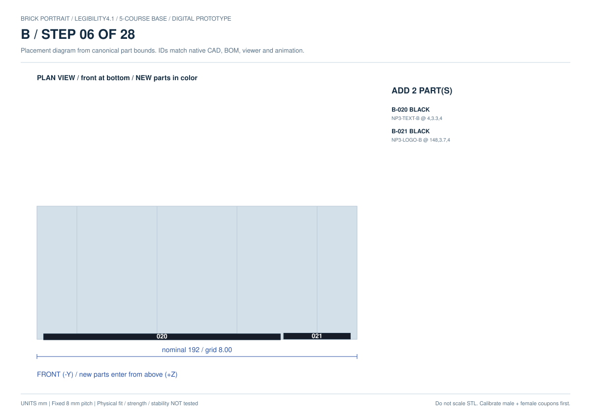
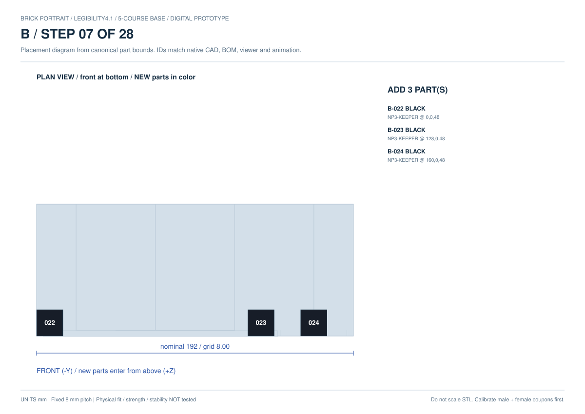

# Bの28工程

[入口](../README.md) · [オフライン3D](../guide/index.html) · [3Dの使い方](GUIDE.md) · [組立・交換・分解](ASSEMBLY.md) · [全図PDF](../kit/B/drawings.pdf)

**ZIPを展開して `guide/index.html` をダブルクリック。空の机から全28工程を3Dで進められます。**
Python／Node／ネット接続は閲覧に不要です。印刷順と組立順は別です。
**工程1は `B-black-02.3mf` のslot 3、`BASE3-24x10-B-562406` → `B-001`。**
black-01の8個は2〜5段目用です。台座5段の出処はblack-01〜04にまたがります。
slot番号は案内用で刻印なし。同一ID・色の実物は可換で、特定個体の割当ではありません。

図の下が手前（銘板側）です。追加する配置番号を、その工程の図で確認します。
最終工程は確認だけで、新しい部品はありません。図は実CAD由来で、実物の合格証拠ではありません。

[全150slotの対応CSV](../kit/B/part-map.csv) · [全14枚の部品・寸法表](FILES.md)

| 工程図 | 内容 | 追加数 | 配置番号 | 3MFの便宜出処 |
|---|---|---:|---|---|
| [01](../kit/B/drawings/step-01.svg) | 黒い台座 1 / 5段目を積む（縦の継ぎ目をずらす） | 1 | `B-001` | `B-black-02.3mf` |
| [02](../kit/B/drawings/step-02.svg) | 黒い台座 2 / 5段目を積む（縦の継ぎ目をずらす） | 4 | `B-002`〜`B-005` | `B-black-01.3mf`、`B-black-02.3mf`、`B-black-03.3mf` |
| [03](../kit/B/drawings/step-03.svg) | 黒い台座 3 / 5段目を積む（縦の継ぎ目をずらす） | 5 | `B-006`〜`B-010` | `B-black-01.3mf`、`B-black-03.3mf` |
| [04](../kit/B/drawings/step-04.svg) | 黒い台座 4 / 5段目を積む（縦の継ぎ目をずらす） | 4 | `B-011`〜`B-014` | `B-black-01.3mf`、`B-black-02.3mf`、`B-black-03.3mf` |
| [05](../kit/B/drawings/step-05.svg) | 黒い台座 5 / 5段目を積む（縦の継ぎ目をずらす） | 5 | `B-015`〜`B-019` | `B-black-01.3mf`、`B-black-04.3mf` |
| [06](../kit/B/drawings/step-06.svg) | 大きい2行銘板と、その右隣のロゴを別々に前面の溝へ差し込む | 2 | `B-020`〜`B-021` | `B-black-to-white-z2p4-01.3mf`、`B-black-to-white-z2p8-01.3mf` |
| [07](../kit/B/drawings/step-07.svg) | 銘板用2個・ロゴ用1個の黒いキーパーを2列目のスタッドに載せる | 3 | `B-022`〜`B-024` | `B-black-07.3mf` |
| [08](../kit/B/drawings/step-08.svg) | 本体 1 段目を左から載せる | 3 | `B-025`〜`B-027` | `B-magenta-01.3mf`、`B-magenta-02.3mf` |
| [09](../kit/B/drawings/step-09.svg) | 本体 2 段目を左から載せる | 5 | `B-028`〜`B-032` | `B-black-04.3mf`、`B-black-05.3mf`、`B-magenta-01.3mf` |
| [10](../kit/B/drawings/step-10.svg) | 本体 3 段目を左から載せる | 5 | `B-033`〜`B-037` | `B-black-04.3mf`、`B-black-05.3mf`、`B-magenta-01.3mf` |
| [11](../kit/B/drawings/step-11.svg) | 本体 4 段目を左から載せる | 6 | `B-038`〜`B-043` | `B-black-04.3mf`、`B-black-05.3mf`、`B-magenta-01.3mf` |
| [12](../kit/B/drawings/step-12.svg) | 本体 5 段目を左から載せる | 7 | `B-044`〜`B-050` | `B-black-05.3mf`、`B-black-06.3mf`、`B-green-01.3mf`、`B-magenta-01.3mf` |
| [13](../kit/B/drawings/step-13.svg) | 本体 6 段目を左から載せる | 10 | `B-051`〜`B-060` | `B-black-04.3mf`、`B-black-05.3mf`、`B-green-01.3mf`、`B-magenta-01.3mf` |
| [14](../kit/B/drawings/step-14.svg) | 本体 7 段目を左から載せる | 7 | `B-061`〜`B-067` | `B-black-06.3mf`、`B-black-07.3mf`、`B-green-01.3mf`、`B-magenta-01.3mf` |
| [15](../kit/B/drawings/step-15.svg) | 本体 8 段目を左から載せる | 10 | `B-068`〜`B-077` | `B-black-04.3mf`、`B-black-05.3mf`、`B-green-01.3mf`、`B-magenta-01.3mf` |
| [16](../kit/B/drawings/step-16.svg) | 本体 9 段目を左から載せる | 6 | `B-078`〜`B-083` | `B-black-06.3mf`、`B-magenta-01.3mf` |
| [17](../kit/B/drawings/step-17.svg) | 本体 10 段目を左から載せる | 6 | `B-084`〜`B-089` | `B-cyan-01.3mf`、`B-cyan-02.3mf` |
| [18](../kit/B/drawings/step-18.svg) | 本体 11 段目を左から載せる | 7 | `B-090`〜`B-096` | `B-black-05.3mf`、`B-black-06.3mf`、`B-cyan-01.3mf` |
| [19](../kit/B/drawings/step-19.svg) | 本体 12 段目を左から載せる | 7 | `B-097`〜`B-103` | `B-black-04.3mf`、`B-black-07.3mf`、`B-cyan-01.3mf` |
| [20](../kit/B/drawings/step-20.svg) | 本体 13 段目を左から載せる | 7 | `B-104`〜`B-110` | `B-black-05.3mf`、`B-black-06.3mf`、`B-cyan-01.3mf` |
| [21](../kit/B/drawings/step-21.svg) | 本体 14 段目を左から載せる | 7 | `B-111`〜`B-117` | `B-black-04.3mf`、`B-black-07.3mf`、`B-cyan-01.3mf` |
| [22](../kit/B/drawings/step-22.svg) | 本体 15 段目を左から載せる | 7 | `B-118`〜`B-124` | `B-black-05.3mf`、`B-black-06.3mf`、`B-cyan-01.3mf` |
| [23](../kit/B/drawings/step-23.svg) | 本体 16 段目を左から載せる | 7 | `B-125`〜`B-131` | `B-black-05.3mf`、`B-black-07.3mf`、`B-cyan-01.3mf` |
| [24](../kit/B/drawings/step-24.svg) | 本体 17 段目を左から載せる | 7 | `B-132`〜`B-138` | `B-black-05.3mf`、`B-black-06.3mf`、`B-cyan-01.3mf` |
| [25](../kit/B/drawings/step-25.svg) | 本体 18 段目を左から載せる | 5 | `B-139`〜`B-143` | `B-cyan-01.3mf`、`B-cyan-02.3mf` |
| [26](../kit/B/drawings/step-26.svg) | 本体 19 段目を左から載せる | 4 | `B-144`〜`B-147` | `B-cyan-02.3mf` |
| [27](../kit/B/drawings/step-27.svg) | 頭頂のマゼンタのプレートを載せる | 3 | `B-148`〜`B-150` | `B-magenta-01.3mf` |
| [28](../kit/B/drawings/step-28.svg) | 2行と右ロゴが5段台座の正面内に収まること、保持と転倒を確認する | 0 | 追加なし | 追加なし |

工程1〜5は台座、6は前面2部品、7はkeeper、8〜26は顔19段、27は頭頂、28は確認です。
試作の端部2個だけを積む操作を、正式な5段配置と取り違えないでください。

最初の1枚はblack-02 slot 3。前面はblack-to-white-z2p4／z2p8の各slot 1、keeperはblack-07 slot 8〜10です。持ち上げ・透過・分解表示は説明用で、物理的な経路保証ではありません。

## 前面の取り付け図

## 1個ごとの取り出し表

以下は3MFの元の順番に対応させた便宜割当です。同一ID・同一色なら別slotの良品を使えます。
実物への刻印ではありません。試作から流用した分もここへ引き当て、再印刷を重複させません。

### 工程1：黒い台座 1 / 5段目を積む（縦の継ぎ目をずらす）

| 配置番号 | 部品ID | 3MF | slot | 印刷姿勢の外形 mm |
|---|---|---|---:|---|
| `B-001` | [BASE3-24x10-B-562406](../kit/B/parts/BASE3-24x10-B-562406.stl) | [B-black-02.3mf](../kit/B/plates/B-black-02.3mf) | 3 | 191.8 × 79.8 × 11.4 |

### 工程2：黒い台座 2 / 5段目を積む（縦の継ぎ目をずらす）

| 配置番号 | 部品ID | 3MF | slot | 印刷姿勢の外形 mm |
|---|---|---|---:|---|
| `B-002` | [BASE3-06x10-T-e1945a](../kit/B/parts/BASE3-06x10-T-e1945a.stl) | [B-black-02.3mf](../kit/B/plates/B-black-02.3mf) | 1 | 47.8 × 79.8 × 11.4 |
| `B-003` | [BASE3-06x10-T-838259](../kit/B/parts/BASE3-06x10-T-838259.stl) | [B-black-03.3mf](../kit/B/plates/B-black-03.3mf) | 3 | 47.8 × 76.4 × 11.4 |
| `B-004` | [BASE3-06x10-T-3f87ac](../kit/B/parts/BASE3-06x10-T-3f87ac.stl) | [B-black-03.3mf](../kit/B/plates/B-black-03.3mf) | 1 | 47.8 × 76.4 × 11.4 |
| `B-005` | [BASE3-06x10-T-6e100f](../kit/B/parts/BASE3-06x10-T-6e100f.stl) | [B-black-01.3mf](../kit/B/plates/B-black-01.3mf) | 7 | 47.8 × 79.8 × 11.4 |

### 工程3：黒い台座 3 / 5段目を積む（縦の継ぎ目をずらす）

| 配置番号 | 部品ID | 3MF | slot | 印刷姿勢の外形 mm |
|---|---|---|---:|---|
| `B-006` | [BASE3-03x10-T-aa77a9](../kit/B/parts/BASE3-03x10-T-aa77a9.stl) | [B-black-01.3mf](../kit/B/plates/B-black-01.3mf) | 1 | 23.8 × 79.8 × 11.4 |
| `B-007` | [BASE3-06x10-T-838259](../kit/B/parts/BASE3-06x10-T-838259.stl) | [B-black-03.3mf](../kit/B/plates/B-black-03.3mf) | 4 | 47.8 × 76.4 × 11.4 |
| `B-008` | [BASE3-06x10-T-838259](../kit/B/parts/BASE3-06x10-T-838259.stl) | [B-black-03.3mf](../kit/B/plates/B-black-03.3mf) | 5 | 47.8 × 76.4 × 11.4 |
| `B-009` | [BASE3-06x10-T-6159e6](../kit/B/parts/BASE3-06x10-T-6159e6.stl) | [B-black-01.3mf](../kit/B/plates/B-black-01.3mf) | 5 | 47.8 × 79.8 × 11.4 |
| `B-010` | [BASE3-03x10-T-d79875](../kit/B/parts/BASE3-03x10-T-d79875.stl) | [B-black-01.3mf](../kit/B/plates/B-black-01.3mf) | 3 | 23.8 × 79.8 × 11.4 |

### 工程4：黒い台座 4 / 5段目を積む（縦の継ぎ目をずらす）

| 配置番号 | 部品ID | 3MF | slot | 印刷姿勢の外形 mm |
|---|---|---|---:|---|
| `B-011` | [BASE3-06x10-T-e1945a](../kit/B/parts/BASE3-06x10-T-e1945a.stl) | [B-black-02.3mf](../kit/B/plates/B-black-02.3mf) | 2 | 47.8 × 79.8 × 11.4 |
| `B-012` | [BASE3-06x10-T-838259](../kit/B/parts/BASE3-06x10-T-838259.stl) | [B-black-03.3mf](../kit/B/plates/B-black-03.3mf) | 6 | 47.8 × 76.4 × 11.4 |
| `B-013` | [BASE3-06x10-T-3f87ac](../kit/B/parts/BASE3-06x10-T-3f87ac.stl) | [B-black-03.3mf](../kit/B/plates/B-black-03.3mf) | 2 | 47.8 × 76.4 × 11.4 |
| `B-014` | [BASE3-06x10-T-6e100f](../kit/B/parts/BASE3-06x10-T-6e100f.stl) | [B-black-01.3mf](../kit/B/plates/B-black-01.3mf) | 8 | 47.8 × 79.8 × 11.4 |

### 工程5：黒い台座 5 / 5段目を積む（縦の継ぎ目をずらす）

| 配置番号 | 部品ID | 3MF | slot | 印刷姿勢の外形 mm |
|---|---|---|---:|---|
| `B-015` | [BASE3-03x10-T-aa77a9](../kit/B/parts/BASE3-03x10-T-aa77a9.stl) | [B-black-01.3mf](../kit/B/plates/B-black-01.3mf) | 2 | 23.8 × 79.8 × 11.4 |
| `B-016` | [BASE3-06x10-T-838259](../kit/B/parts/BASE3-06x10-T-838259.stl) | [B-black-04.3mf](../kit/B/plates/B-black-04.3mf) | 1 | 47.8 × 76.4 × 11.4 |
| `B-017` | [BASE3-06x10-T-838259](../kit/B/parts/BASE3-06x10-T-838259.stl) | [B-black-04.3mf](../kit/B/plates/B-black-04.3mf) | 2 | 47.8 × 76.4 × 11.4 |
| `B-018` | [BASE3-06x10-T-6159e6](../kit/B/parts/BASE3-06x10-T-6159e6.stl) | [B-black-01.3mf](../kit/B/plates/B-black-01.3mf) | 6 | 47.8 × 79.8 × 11.4 |
| `B-019` | [BASE3-03x10-T-d79875](../kit/B/parts/BASE3-03x10-T-d79875.stl) | [B-black-01.3mf](../kit/B/plates/B-black-01.3mf) | 4 | 23.8 × 79.8 × 11.4 |

### 工程6：大きい2行銘板と、その右隣のロゴを別々に前面の溝へ差し込む

| 配置番号 | 部品ID | 3MF | slot | 印刷姿勢の外形 mm |
|---|---|---|---:|---|
| `B-020` | [NP3-TEXT-B](../kit/B/parts/NP3-TEXT-B.stl) | [B-black-to-white-z2p4-01.3mf](../kit/B/plates/B-black-to-white-z2p4-01.3mf) | 1 | 142 × 40 × 3.2 |
| `B-021` | [NP3-LOGO-B](../kit/B/parts/NP3-LOGO-B.stl) | [B-black-to-white-z2p8-01.3mf](../kit/B/plates/B-black-to-white-z2p8-01.3mf) | 1 | 40 × 40 × 3.6 |

### 工程7：銘板用2個・ロゴ用1個の黒いキーパーを2列目のスタッドに載せる

| 配置番号 | 部品ID | 3MF | slot | 印刷姿勢の外形 mm |
|---|---|---|---:|---|
| `B-022` | [NP3-KEEPER](../kit/B/parts/NP3-KEEPER.stl) | [B-black-07.3mf](../kit/B/plates/B-black-07.3mf) | 8 | 15.8 × 15.8 × 3.2 |
| `B-023` | [NP3-KEEPER](../kit/B/parts/NP3-KEEPER.stl) | [B-black-07.3mf](../kit/B/plates/B-black-07.3mf) | 9 | 15.8 × 15.8 × 3.2 |
| `B-024` | [NP3-KEEPER](../kit/B/parts/NP3-KEEPER.stl) | [B-black-07.3mf](../kit/B/plates/B-black-07.3mf) | 10 | 15.8 × 15.8 × 3.2 |

### 工程8：本体 1 段目を左から載せる

| 配置番号 | 部品ID | 3MF | slot | 印刷姿勢の外形 mm |
|---|---|---|---:|---|
| `B-025` | [BR-04x04-H096](../kit/B/parts/BR-04x04-H096.stl) | [B-magenta-02.3mf](../kit/B/plates/B-magenta-02.3mf) | 1 | 31.8 × 31.8 × 11.4 |
| `B-026` | [BR-04x04-H096](../kit/B/parts/BR-04x04-H096.stl) | [B-magenta-02.3mf](../kit/B/plates/B-magenta-02.3mf) | 2 | 31.8 × 31.8 × 11.4 |
| `B-027` | [BR-02x04-H096](../kit/B/parts/BR-02x04-H096.stl) | [B-magenta-01.3mf](../kit/B/plates/B-magenta-01.3mf) | 19 | 15.8 × 31.8 × 11.4 |

### 工程9：本体 2 段目を左から載せる

| 配置番号 | 部品ID | 3MF | slot | 印刷姿勢の外形 mm |
|---|---|---|---:|---|
| `B-028` | [BR-02x06-H096](../kit/B/parts/BR-02x06-H096.stl) | [B-magenta-01.3mf](../kit/B/plates/B-magenta-01.3mf) | 1 | 15.8 × 47.8 × 11.4 |
| `B-029` | [BR-02x04-H096](../kit/B/parts/BR-02x04-H096.stl) | [B-black-04.3mf](../kit/B/plates/B-black-04.3mf) | 3 | 15.8 × 31.8 × 11.4 |
| `B-030` | [BR-04x04-H096](../kit/B/parts/BR-04x04-H096.stl) | [B-black-05.3mf](../kit/B/plates/B-black-05.3mf) | 15 | 31.8 × 31.8 × 11.4 |
| `B-031` | [BR-02x04-H096](../kit/B/parts/BR-02x04-H096.stl) | [B-black-04.3mf](../kit/B/plates/B-black-04.3mf) | 4 | 15.8 × 31.8 × 11.4 |
| `B-032` | [BR-02x06-H096](../kit/B/parts/BR-02x06-H096.stl) | [B-magenta-01.3mf](../kit/B/plates/B-magenta-01.3mf) | 2 | 15.8 × 47.8 × 11.4 |

### 工程10：本体 3 段目を左から載せる

| 配置番号 | 部品ID | 3MF | slot | 印刷姿勢の外形 mm |
|---|---|---|---:|---|
| `B-033` | [BR-02x06-H096](../kit/B/parts/BR-02x06-H096.stl) | [B-magenta-01.3mf](../kit/B/plates/B-magenta-01.3mf) | 3 | 15.8 × 47.8 × 11.4 |
| `B-034` | [BR-04x04-H096](../kit/B/parts/BR-04x04-H096.stl) | [B-black-05.3mf](../kit/B/plates/B-black-05.3mf) | 16 | 31.8 × 31.8 × 11.4 |
| `B-035` | [BR-04x04-H096](../kit/B/parts/BR-04x04-H096.stl) | [B-black-05.3mf](../kit/B/plates/B-black-05.3mf) | 17 | 31.8 × 31.8 × 11.4 |
| `B-036` | [BR-02x04-H096](../kit/B/parts/BR-02x04-H096.stl) | [B-black-04.3mf](../kit/B/plates/B-black-04.3mf) | 5 | 15.8 × 31.8 × 11.4 |
| `B-037` | [BR-02x06-H096](../kit/B/parts/BR-02x06-H096.stl) | [B-magenta-01.3mf](../kit/B/plates/B-magenta-01.3mf) | 4 | 15.8 × 47.8 × 11.4 |

### 工程11：本体 4 段目を左から載せる

| 配置番号 | 部品ID | 3MF | slot | 印刷姿勢の外形 mm |
|---|---|---|---:|---|
| `B-038` | [BR-02x06-H096](../kit/B/parts/BR-02x06-H096.stl) | [B-magenta-01.3mf](../kit/B/plates/B-magenta-01.3mf) | 5 | 15.8 × 47.8 × 11.4 |
| `B-039` | [BR-02x04-H096](../kit/B/parts/BR-02x04-H096.stl) | [B-black-04.3mf](../kit/B/plates/B-black-04.3mf) | 6 | 15.8 × 31.8 × 11.4 |
| `B-040` | [BR-04x04-H096](../kit/B/parts/BR-04x04-H096.stl) | [B-black-05.3mf](../kit/B/plates/B-black-05.3mf) | 18 | 31.8 × 31.8 × 11.4 |
| `B-041` | [BR-04x04-H096](../kit/B/parts/BR-04x04-H096.stl) | [B-black-05.3mf](../kit/B/plates/B-black-05.3mf) | 19 | 31.8 × 31.8 × 11.4 |
| `B-042` | [BR-02x04-H096](../kit/B/parts/BR-02x04-H096.stl) | [B-black-04.3mf](../kit/B/plates/B-black-04.3mf) | 7 | 15.8 × 31.8 × 11.4 |
| `B-043` | [BR-02x06-H096](../kit/B/parts/BR-02x06-H096.stl) | [B-magenta-01.3mf](../kit/B/plates/B-magenta-01.3mf) | 6 | 15.8 × 47.8 × 11.4 |

### 工程12：本体 5 段目を左から載せる

| 配置番号 | 部品ID | 3MF | slot | 印刷姿勢の外形 mm |
|---|---|---|---:|---|
| `B-044` | [BR-02x06-H096](../kit/B/parts/BR-02x06-H096.stl) | [B-magenta-01.3mf](../kit/B/plates/B-magenta-01.3mf) | 7 | 15.8 × 47.8 × 11.4 |
| `B-045` | [BR-04x04-H096](../kit/B/parts/BR-04x04-H096.stl) | [B-black-05.3mf](../kit/B/plates/B-black-05.3mf) | 20 | 31.8 × 31.8 × 11.4 |
| `B-046` | [BR-01x04-H096](../kit/B/parts/BR-01x04-H096.stl) | [B-green-01.3mf](../kit/B/plates/B-green-01.3mf) | 1 | 7.8 × 31.8 × 11.4 |
| `B-047` | [BR-04x04-H096](../kit/B/parts/BR-04x04-H096.stl) | [B-black-06.3mf](../kit/B/plates/B-black-06.3mf) | 1 | 31.8 × 31.8 × 11.4 |
| `B-048` | [BR-01x04-H096](../kit/B/parts/BR-01x04-H096.stl) | [B-green-01.3mf](../kit/B/plates/B-green-01.3mf) | 2 | 7.8 × 31.8 × 11.4 |
| `B-049` | [BR-04x04-H096](../kit/B/parts/BR-04x04-H096.stl) | [B-black-06.3mf](../kit/B/plates/B-black-06.3mf) | 2 | 31.8 × 31.8 × 11.4 |
| `B-050` | [BR-02x06-H096](../kit/B/parts/BR-02x06-H096.stl) | [B-magenta-01.3mf](../kit/B/plates/B-magenta-01.3mf) | 8 | 15.8 × 47.8 × 11.4 |

### 工程13：本体 6 段目を左から載せる

| 配置番号 | 部品ID | 3MF | slot | 印刷姿勢の外形 mm |
|---|---|---|---:|---|
| `B-051` | [BR-02x06-H096](../kit/B/parts/BR-02x06-H096.stl) | [B-magenta-01.3mf](../kit/B/plates/B-magenta-01.3mf) | 9 | 15.8 × 47.8 × 11.4 |
| `B-052` | [BR-02x04-H096](../kit/B/parts/BR-02x04-H096.stl) | [B-black-04.3mf](../kit/B/plates/B-black-04.3mf) | 8 | 15.8 × 31.8 × 11.4 |
| `B-053` | [BR-03x04-H096](../kit/B/parts/BR-03x04-H096.stl) | [B-black-05.3mf](../kit/B/plates/B-black-05.3mf) | 3 | 23.8 × 31.8 × 11.4 |
| `B-054` | [BR-01x04-H096](../kit/B/parts/BR-01x04-H096.stl) | [B-green-01.3mf](../kit/B/plates/B-green-01.3mf) | 3 | 7.8 × 31.8 × 11.4 |
| `B-055` | [BR-02x04-H096](../kit/B/parts/BR-02x04-H096.stl) | [B-black-04.3mf](../kit/B/plates/B-black-04.3mf) | 9 | 15.8 × 31.8 × 11.4 |
| `B-056` | [BR-02x04-H096](../kit/B/parts/BR-02x04-H096.stl) | [B-black-04.3mf](../kit/B/plates/B-black-04.3mf) | 10 | 15.8 × 31.8 × 11.4 |
| `B-057` | [BR-01x04-H096](../kit/B/parts/BR-01x04-H096.stl) | [B-green-01.3mf](../kit/B/plates/B-green-01.3mf) | 4 | 7.8 × 31.8 × 11.4 |
| `B-058` | [BR-02x04-H096](../kit/B/parts/BR-02x04-H096.stl) | [B-black-04.3mf](../kit/B/plates/B-black-04.3mf) | 11 | 15.8 × 31.8 × 11.4 |
| `B-059` | [BR-03x04-H096](../kit/B/parts/BR-03x04-H096.stl) | [B-black-05.3mf](../kit/B/plates/B-black-05.3mf) | 4 | 23.8 × 31.8 × 11.4 |
| `B-060` | [BR-02x06-H096](../kit/B/parts/BR-02x06-H096.stl) | [B-magenta-01.3mf](../kit/B/plates/B-magenta-01.3mf) | 10 | 15.8 × 47.8 × 11.4 |

### 工程14：本体 7 段目を左から載せる

| 配置番号 | 部品ID | 3MF | slot | 印刷姿勢の外形 mm |
|---|---|---|---:|---|
| `B-061` | [BR-02x06-H096](../kit/B/parts/BR-02x06-H096.stl) | [B-magenta-01.3mf](../kit/B/plates/B-magenta-01.3mf) | 11 | 15.8 × 47.8 × 11.4 |
| `B-062` | [BR-05x04-H096](../kit/B/parts/BR-05x04-H096.stl) | [B-black-06.3mf](../kit/B/plates/B-black-06.3mf) | 16 | 39.8 × 31.8 × 11.4 |
| `B-063` | [BR-01x04-H096](../kit/B/parts/BR-01x04-H096.stl) | [B-green-01.3mf](../kit/B/plates/B-green-01.3mf) | 5 | 7.8 × 31.8 × 11.4 |
| `B-064` | [BR-04x04-H096](../kit/B/parts/BR-04x04-H096.stl) | [B-black-06.3mf](../kit/B/plates/B-black-06.3mf) | 3 | 31.8 × 31.8 × 11.4 |
| `B-065` | [BR-01x04-H096](../kit/B/parts/BR-01x04-H096.stl) | [B-green-01.3mf](../kit/B/plates/B-green-01.3mf) | 6 | 7.8 × 31.8 × 11.4 |
| `B-066` | [BR-05x04-H096](../kit/B/parts/BR-05x04-H096.stl) | [B-black-07.3mf](../kit/B/plates/B-black-07.3mf) | 1 | 39.8 × 31.8 × 11.4 |
| `B-067` | [BR-02x06-H096](../kit/B/parts/BR-02x06-H096.stl) | [B-magenta-01.3mf](../kit/B/plates/B-magenta-01.3mf) | 12 | 15.8 × 47.8 × 11.4 |

### 工程15：本体 8 段目を左から載せる

| 配置番号 | 部品ID | 3MF | slot | 印刷姿勢の外形 mm |
|---|---|---|---:|---|
| `B-068` | [BR-02x06-H096](../kit/B/parts/BR-02x06-H096.stl) | [B-magenta-01.3mf](../kit/B/plates/B-magenta-01.3mf) | 13 | 15.8 × 47.8 × 11.4 |
| `B-069` | [BR-02x04-H096](../kit/B/parts/BR-02x04-H096.stl) | [B-black-04.3mf](../kit/B/plates/B-black-04.3mf) | 12 | 15.8 × 31.8 × 11.4 |
| `B-070` | [BR-03x04-H096](../kit/B/parts/BR-03x04-H096.stl) | [B-black-05.3mf](../kit/B/plates/B-black-05.3mf) | 5 | 23.8 × 31.8 × 11.4 |
| `B-071` | [BR-01x04-H096](../kit/B/parts/BR-01x04-H096.stl) | [B-green-01.3mf](../kit/B/plates/B-green-01.3mf) | 7 | 7.8 × 31.8 × 11.4 |
| `B-072` | [BR-02x04-H096](../kit/B/parts/BR-02x04-H096.stl) | [B-black-04.3mf](../kit/B/plates/B-black-04.3mf) | 13 | 15.8 × 31.8 × 11.4 |
| `B-073` | [BR-02x04-H096](../kit/B/parts/BR-02x04-H096.stl) | [B-black-04.3mf](../kit/B/plates/B-black-04.3mf) | 14 | 15.8 × 31.8 × 11.4 |
| `B-074` | [BR-01x04-H096](../kit/B/parts/BR-01x04-H096.stl) | [B-green-01.3mf](../kit/B/plates/B-green-01.3mf) | 8 | 7.8 × 31.8 × 11.4 |
| `B-075` | [BR-02x04-H096](../kit/B/parts/BR-02x04-H096.stl) | [B-black-04.3mf](../kit/B/plates/B-black-04.3mf) | 15 | 15.8 × 31.8 × 11.4 |
| `B-076` | [BR-03x04-H096](../kit/B/parts/BR-03x04-H096.stl) | [B-black-05.3mf](../kit/B/plates/B-black-05.3mf) | 6 | 23.8 × 31.8 × 11.4 |
| `B-077` | [BR-02x06-H096](../kit/B/parts/BR-02x06-H096.stl) | [B-magenta-01.3mf](../kit/B/plates/B-magenta-01.3mf) | 14 | 15.8 × 47.8 × 11.4 |

### 工程16：本体 9 段目を左から載せる

| 配置番号 | 部品ID | 3MF | slot | 印刷姿勢の外形 mm |
|---|---|---|---:|---|
| `B-078` | [BR-02x06-H096](../kit/B/parts/BR-02x06-H096.stl) | [B-magenta-01.3mf](../kit/B/plates/B-magenta-01.3mf) | 15 | 15.8 × 47.8 × 11.4 |
| `B-079` | [BR-04x04-H096](../kit/B/parts/BR-04x04-H096.stl) | [B-black-06.3mf](../kit/B/plates/B-black-06.3mf) | 4 | 31.8 × 31.8 × 11.4 |
| `B-080` | [BR-04x04-H096](../kit/B/parts/BR-04x04-H096.stl) | [B-black-06.3mf](../kit/B/plates/B-black-06.3mf) | 5 | 31.8 × 31.8 × 11.4 |
| `B-081` | [BR-04x04-H096](../kit/B/parts/BR-04x04-H096.stl) | [B-black-06.3mf](../kit/B/plates/B-black-06.3mf) | 6 | 31.8 × 31.8 × 11.4 |
| `B-082` | [BR-04x04-H096](../kit/B/parts/BR-04x04-H096.stl) | [B-black-06.3mf](../kit/B/plates/B-black-06.3mf) | 7 | 31.8 × 31.8 × 11.4 |
| `B-083` | [BR-02x06-H096](../kit/B/parts/BR-02x06-H096.stl) | [B-magenta-01.3mf](../kit/B/plates/B-magenta-01.3mf) | 16 | 15.8 × 47.8 × 11.4 |

### 工程17：本体 10 段目を左から載せる

| 配置番号 | 部品ID | 3MF | slot | 印刷姿勢の外形 mm |
|---|---|---|---:|---|
| `B-084` | [BR-02x05-H096](../kit/B/parts/BR-02x05-H096.stl) | [B-cyan-01.3mf](../kit/B/plates/B-cyan-01.3mf) | 1 | 15.8 × 39.8 × 11.4 |
| `B-085` | [BR-04x05-H096](../kit/B/parts/BR-04x05-H096.stl) | [B-cyan-01.3mf](../kit/B/plates/B-cyan-01.3mf) | 25 | 31.8 × 39.8 × 11.4 |
| `B-086` | [BR-04x05-H096](../kit/B/parts/BR-04x05-H096.stl) | [B-cyan-01.3mf](../kit/B/plates/B-cyan-01.3mf) | 26 | 31.8 × 39.8 × 11.4 |
| `B-087` | [BR-04x05-H096](../kit/B/parts/BR-04x05-H096.stl) | [B-cyan-02.3mf](../kit/B/plates/B-cyan-02.3mf) | 1 | 31.8 × 39.8 × 11.4 |
| `B-088` | [BR-04x05-H096](../kit/B/parts/BR-04x05-H096.stl) | [B-cyan-02.3mf](../kit/B/plates/B-cyan-02.3mf) | 2 | 31.8 × 39.8 × 11.4 |
| `B-089` | [BR-02x05-H096](../kit/B/parts/BR-02x05-H096.stl) | [B-cyan-01.3mf](../kit/B/plates/B-cyan-01.3mf) | 2 | 15.8 × 39.8 × 11.4 |

### 工程18：本体 11 段目を左から載せる

| 配置番号 | 部品ID | 3MF | slot | 印刷姿勢の外形 mm |
|---|---|---|---:|---|
| `B-090` | [BR-02x05-H096](../kit/B/parts/BR-02x05-H096.stl) | [B-cyan-01.3mf](../kit/B/plates/B-cyan-01.3mf) | 3 | 15.8 × 39.8 × 11.4 |
| `B-091` | [BR-04x04-H096](../kit/B/parts/BR-04x04-H096.stl) | [B-black-06.3mf](../kit/B/plates/B-black-06.3mf) | 8 | 31.8 × 31.8 × 11.4 |
| `B-092` | [BR-03x04-H096](../kit/B/parts/BR-03x04-H096.stl) | [B-black-05.3mf](../kit/B/plates/B-black-05.3mf) | 7 | 23.8 × 31.8 × 11.4 |
| `B-093` | [BR-02x05-H096](../kit/B/parts/BR-02x05-H096.stl) | [B-cyan-01.3mf](../kit/B/plates/B-cyan-01.3mf) | 4 | 15.8 × 39.8 × 11.4 |
| `B-094` | [BR-04x04-H096](../kit/B/parts/BR-04x04-H096.stl) | [B-black-06.3mf](../kit/B/plates/B-black-06.3mf) | 9 | 31.8 × 31.8 × 11.4 |
| `B-095` | [BR-03x04-H096](../kit/B/parts/BR-03x04-H096.stl) | [B-black-05.3mf](../kit/B/plates/B-black-05.3mf) | 8 | 23.8 × 31.8 × 11.4 |
| `B-096` | [BR-02x05-H096](../kit/B/parts/BR-02x05-H096.stl) | [B-cyan-01.3mf](../kit/B/plates/B-cyan-01.3mf) | 5 | 15.8 × 39.8 × 11.4 |

### 工程19：本体 12 段目を左から載せる

| 配置番号 | 部品ID | 3MF | slot | 印刷姿勢の外形 mm |
|---|---|---|---:|---|
| `B-097` | [BR-02x05-H096](../kit/B/parts/BR-02x05-H096.stl) | [B-cyan-01.3mf](../kit/B/plates/B-cyan-01.3mf) | 6 | 15.8 × 39.8 × 11.4 |
| `B-098` | [BR-02x04-H096](../kit/B/parts/BR-02x04-H096.stl) | [B-black-04.3mf](../kit/B/plates/B-black-04.3mf) | 16 | 15.8 × 31.8 × 11.4 |
| `B-099` | [BR-05x04-H096](../kit/B/parts/BR-05x04-H096.stl) | [B-black-07.3mf](../kit/B/plates/B-black-07.3mf) | 2 | 39.8 × 31.8 × 11.4 |
| `B-100` | [BR-02x05-H096](../kit/B/parts/BR-02x05-H096.stl) | [B-cyan-01.3mf](../kit/B/plates/B-cyan-01.3mf) | 7 | 15.8 × 39.8 × 11.4 |
| `B-101` | [BR-02x04-H096](../kit/B/parts/BR-02x04-H096.stl) | [B-black-04.3mf](../kit/B/plates/B-black-04.3mf) | 17 | 15.8 × 31.8 × 11.4 |
| `B-102` | [BR-05x04-H096](../kit/B/parts/BR-05x04-H096.stl) | [B-black-07.3mf](../kit/B/plates/B-black-07.3mf) | 3 | 39.8 × 31.8 × 11.4 |
| `B-103` | [BR-02x05-H096](../kit/B/parts/BR-02x05-H096.stl) | [B-cyan-01.3mf](../kit/B/plates/B-cyan-01.3mf) | 8 | 15.8 × 39.8 × 11.4 |

### 工程20：本体 13 段目を左から載せる

| 配置番号 | 部品ID | 3MF | slot | 印刷姿勢の外形 mm |
|---|---|---|---:|---|
| `B-104` | [BR-02x05-H096](../kit/B/parts/BR-02x05-H096.stl) | [B-cyan-01.3mf](../kit/B/plates/B-cyan-01.3mf) | 9 | 15.8 × 39.8 × 11.4 |
| `B-105` | [BR-04x04-H096](../kit/B/parts/BR-04x04-H096.stl) | [B-black-06.3mf](../kit/B/plates/B-black-06.3mf) | 10 | 31.8 × 31.8 × 11.4 |
| `B-106` | [BR-03x04-H096](../kit/B/parts/BR-03x04-H096.stl) | [B-black-05.3mf](../kit/B/plates/B-black-05.3mf) | 9 | 23.8 × 31.8 × 11.4 |
| `B-107` | [BR-02x05-H096](../kit/B/parts/BR-02x05-H096.stl) | [B-cyan-01.3mf](../kit/B/plates/B-cyan-01.3mf) | 10 | 15.8 × 39.8 × 11.4 |
| `B-108` | [BR-04x04-H096](../kit/B/parts/BR-04x04-H096.stl) | [B-black-06.3mf](../kit/B/plates/B-black-06.3mf) | 11 | 31.8 × 31.8 × 11.4 |
| `B-109` | [BR-03x04-H096](../kit/B/parts/BR-03x04-H096.stl) | [B-black-05.3mf](../kit/B/plates/B-black-05.3mf) | 10 | 23.8 × 31.8 × 11.4 |
| `B-110` | [BR-02x05-H096](../kit/B/parts/BR-02x05-H096.stl) | [B-cyan-01.3mf](../kit/B/plates/B-cyan-01.3mf) | 11 | 15.8 × 39.8 × 11.4 |

### 工程21：本体 14 段目を左から載せる

| 配置番号 | 部品ID | 3MF | slot | 印刷姿勢の外形 mm |
|---|---|---|---:|---|
| `B-111` | [BR-02x05-H096](../kit/B/parts/BR-02x05-H096.stl) | [B-cyan-01.3mf](../kit/B/plates/B-cyan-01.3mf) | 12 | 15.8 × 39.8 × 11.4 |
| `B-112` | [BR-02x04-H096](../kit/B/parts/BR-02x04-H096.stl) | [B-black-04.3mf](../kit/B/plates/B-black-04.3mf) | 18 | 15.8 × 31.8 × 11.4 |
| `B-113` | [BR-05x04-H096](../kit/B/parts/BR-05x04-H096.stl) | [B-black-07.3mf](../kit/B/plates/B-black-07.3mf) | 4 | 39.8 × 31.8 × 11.4 |
| `B-114` | [BR-02x05-H096](../kit/B/parts/BR-02x05-H096.stl) | [B-cyan-01.3mf](../kit/B/plates/B-cyan-01.3mf) | 13 | 15.8 × 39.8 × 11.4 |
| `B-115` | [BR-02x04-H096](../kit/B/parts/BR-02x04-H096.stl) | [B-black-04.3mf](../kit/B/plates/B-black-04.3mf) | 19 | 15.8 × 31.8 × 11.4 |
| `B-116` | [BR-05x04-H096](../kit/B/parts/BR-05x04-H096.stl) | [B-black-07.3mf](../kit/B/plates/B-black-07.3mf) | 5 | 39.8 × 31.8 × 11.4 |
| `B-117` | [BR-02x05-H096](../kit/B/parts/BR-02x05-H096.stl) | [B-cyan-01.3mf](../kit/B/plates/B-cyan-01.3mf) | 14 | 15.8 × 39.8 × 11.4 |

### 工程22：本体 15 段目を左から載せる

| 配置番号 | 部品ID | 3MF | slot | 印刷姿勢の外形 mm |
|---|---|---|---:|---|
| `B-118` | [BR-02x05-H096](../kit/B/parts/BR-02x05-H096.stl) | [B-cyan-01.3mf](../kit/B/plates/B-cyan-01.3mf) | 15 | 15.8 × 39.8 × 11.4 |
| `B-119` | [BR-04x04-H096](../kit/B/parts/BR-04x04-H096.stl) | [B-black-06.3mf](../kit/B/plates/B-black-06.3mf) | 12 | 31.8 × 31.8 × 11.4 |
| `B-120` | [BR-03x04-H096](../kit/B/parts/BR-03x04-H096.stl) | [B-black-05.3mf](../kit/B/plates/B-black-05.3mf) | 11 | 23.8 × 31.8 × 11.4 |
| `B-121` | [BR-02x05-H096](../kit/B/parts/BR-02x05-H096.stl) | [B-cyan-01.3mf](../kit/B/plates/B-cyan-01.3mf) | 16 | 15.8 × 39.8 × 11.4 |
| `B-122` | [BR-04x04-H096](../kit/B/parts/BR-04x04-H096.stl) | [B-black-06.3mf](../kit/B/plates/B-black-06.3mf) | 13 | 31.8 × 31.8 × 11.4 |
| `B-123` | [BR-03x04-H096](../kit/B/parts/BR-03x04-H096.stl) | [B-black-05.3mf](../kit/B/plates/B-black-05.3mf) | 12 | 23.8 × 31.8 × 11.4 |
| `B-124` | [BR-02x05-H096](../kit/B/parts/BR-02x05-H096.stl) | [B-cyan-01.3mf](../kit/B/plates/B-cyan-01.3mf) | 17 | 15.8 × 39.8 × 11.4 |

### 工程23：本体 16 段目を左から載せる

| 配置番号 | 部品ID | 3MF | slot | 印刷姿勢の外形 mm |
|---|---|---|---:|---|
| `B-125` | [BR-02x05-H096](../kit/B/parts/BR-02x05-H096.stl) | [B-cyan-01.3mf](../kit/B/plates/B-cyan-01.3mf) | 18 | 15.8 × 39.8 × 11.4 |
| `B-126` | [BR-02x04-H096](../kit/B/parts/BR-02x04-H096.stl) | [B-black-05.3mf](../kit/B/plates/B-black-05.3mf) | 1 | 15.8 × 31.8 × 11.4 |
| `B-127` | [BR-05x04-H096](../kit/B/parts/BR-05x04-H096.stl) | [B-black-07.3mf](../kit/B/plates/B-black-07.3mf) | 6 | 39.8 × 31.8 × 11.4 |
| `B-128` | [BR-02x05-H096](../kit/B/parts/BR-02x05-H096.stl) | [B-cyan-01.3mf](../kit/B/plates/B-cyan-01.3mf) | 19 | 15.8 × 39.8 × 11.4 |
| `B-129` | [BR-02x04-H096](../kit/B/parts/BR-02x04-H096.stl) | [B-black-05.3mf](../kit/B/plates/B-black-05.3mf) | 2 | 15.8 × 31.8 × 11.4 |
| `B-130` | [BR-05x04-H096](../kit/B/parts/BR-05x04-H096.stl) | [B-black-07.3mf](../kit/B/plates/B-black-07.3mf) | 7 | 39.8 × 31.8 × 11.4 |
| `B-131` | [BR-02x05-H096](../kit/B/parts/BR-02x05-H096.stl) | [B-cyan-01.3mf](../kit/B/plates/B-cyan-01.3mf) | 20 | 15.8 × 39.8 × 11.4 |

### 工程24：本体 17 段目を左から載せる

| 配置番号 | 部品ID | 3MF | slot | 印刷姿勢の外形 mm |
|---|---|---|---:|---|
| `B-132` | [BR-02x05-H096](../kit/B/parts/BR-02x05-H096.stl) | [B-cyan-01.3mf](../kit/B/plates/B-cyan-01.3mf) | 21 | 15.8 × 39.8 × 11.4 |
| `B-133` | [BR-04x04-H096](../kit/B/parts/BR-04x04-H096.stl) | [B-black-06.3mf](../kit/B/plates/B-black-06.3mf) | 14 | 31.8 × 31.8 × 11.4 |
| `B-134` | [BR-03x04-H096](../kit/B/parts/BR-03x04-H096.stl) | [B-black-05.3mf](../kit/B/plates/B-black-05.3mf) | 13 | 23.8 × 31.8 × 11.4 |
| `B-135` | [BR-02x05-H096](../kit/B/parts/BR-02x05-H096.stl) | [B-cyan-01.3mf](../kit/B/plates/B-cyan-01.3mf) | 22 | 15.8 × 39.8 × 11.4 |
| `B-136` | [BR-04x04-H096](../kit/B/parts/BR-04x04-H096.stl) | [B-black-06.3mf](../kit/B/plates/B-black-06.3mf) | 15 | 31.8 × 31.8 × 11.4 |
| `B-137` | [BR-03x04-H096](../kit/B/parts/BR-03x04-H096.stl) | [B-black-05.3mf](../kit/B/plates/B-black-05.3mf) | 14 | 23.8 × 31.8 × 11.4 |
| `B-138` | [BR-02x05-H096](../kit/B/parts/BR-02x05-H096.stl) | [B-cyan-01.3mf](../kit/B/plates/B-cyan-01.3mf) | 23 | 15.8 × 39.8 × 11.4 |

### 工程25：本体 18 段目を左から載せる

| 配置番号 | 部品ID | 3MF | slot | 印刷姿勢の外形 mm |
|---|---|---|---:|---|
| `B-139` | [BR-02x05-H096](../kit/B/parts/BR-02x05-H096.stl) | [B-cyan-01.3mf](../kit/B/plates/B-cyan-01.3mf) | 24 | 15.8 × 39.8 × 11.4 |
| `B-140` | [BR-04x05-H096](../kit/B/parts/BR-04x05-H096.stl) | [B-cyan-02.3mf](../kit/B/plates/B-cyan-02.3mf) | 3 | 31.8 × 39.8 × 11.4 |
| `B-141` | [BR-04x05-H096](../kit/B/parts/BR-04x05-H096.stl) | [B-cyan-02.3mf](../kit/B/plates/B-cyan-02.3mf) | 4 | 31.8 × 39.8 × 11.4 |
| `B-142` | [BR-04x05-H096](../kit/B/parts/BR-04x05-H096.stl) | [B-cyan-02.3mf](../kit/B/plates/B-cyan-02.3mf) | 5 | 31.8 × 39.8 × 11.4 |
| `B-143` | [BR-04x05-H096](../kit/B/parts/BR-04x05-H096.stl) | [B-cyan-02.3mf](../kit/B/plates/B-cyan-02.3mf) | 6 | 31.8 × 39.8 × 11.4 |

### 工程26：本体 19 段目を左から載せる

| 配置番号 | 部品ID | 3MF | slot | 印刷姿勢の外形 mm |
|---|---|---|---:|---|
| `B-144` | [BR-04x05-H096](../kit/B/parts/BR-04x05-H096.stl) | [B-cyan-02.3mf](../kit/B/plates/B-cyan-02.3mf) | 7 | 31.8 × 39.8 × 11.4 |
| `B-145` | [BR-04x05-H096](../kit/B/parts/BR-04x05-H096.stl) | [B-cyan-02.3mf](../kit/B/plates/B-cyan-02.3mf) | 8 | 31.8 × 39.8 × 11.4 |
| `B-146` | [BR-04x05-H096](../kit/B/parts/BR-04x05-H096.stl) | [B-cyan-02.3mf](../kit/B/plates/B-cyan-02.3mf) | 9 | 31.8 × 39.8 × 11.4 |
| `B-147` | [BR-04x05-H096](../kit/B/parts/BR-04x05-H096.stl) | [B-cyan-02.3mf](../kit/B/plates/B-cyan-02.3mf) | 10 | 31.8 × 39.8 × 11.4 |

### 工程27：頭頂のマゼンタのプレートを載せる

| 配置番号 | 部品ID | 3MF | slot | 印刷姿勢の外形 mm |
|---|---|---|---:|---|
| `B-148` | [BR-02x04-H064](../kit/B/parts/BR-02x04-H064.stl) | [B-magenta-01.3mf](../kit/B/plates/B-magenta-01.3mf) | 17 | 15.8 × 31.8 × 8.2 |
| `B-149` | [BR-04x04-H064](../kit/B/parts/BR-04x04-H064.stl) | [B-magenta-01.3mf](../kit/B/plates/B-magenta-01.3mf) | 20 | 31.8 × 31.8 × 8.2 |
| `B-150` | [BR-02x04-H064](../kit/B/parts/BR-02x04-H064.stl) | [B-magenta-01.3mf](../kit/B/plates/B-magenta-01.3mf) | 18 | 15.8 × 31.8 × 8.2 |

### 工程28：2行と右ロゴが5段台座の正面内に収まること、保持と転倒を確認する

追加0個。150個がそろったら実物の保持・着座・安定を確認します。
